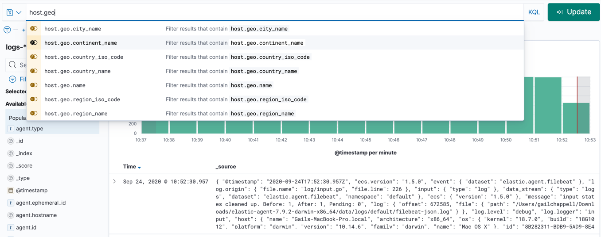
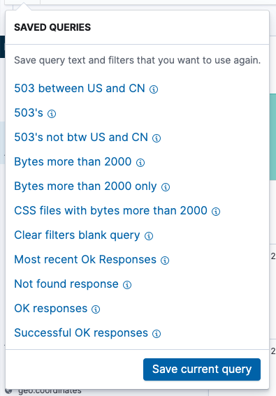
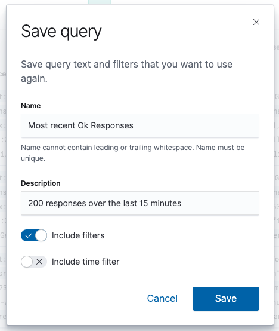
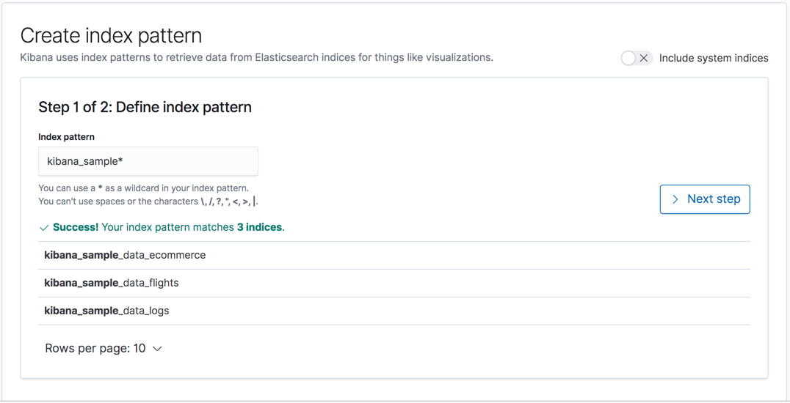

# Elysium Search User Guide
## Overview
1.	[Search basics](#Searchbasics)
2.	[Search query language (KQL)](#KQL)
	* [KQL Introduction](#kqlintroduction)
	* [Preliminary Basics and search rules](#preliminaryBasicsandsearchrules)
	* [Search multiple fields](#Searchmutiplefields)
	* [Grouped together](#groupedtogether)
	* [Terms query](#termquery)
	* [Boolean queries](#booleanqueries)
	* [Range queries](#rangequeries)
	* [Date range queries](#daterangequeries)
	* [Exist queries](#existqueries)
	* [Wildcard queries](#wildcardqueries)
	* [Nested field queries (Subqueries)](#nestedfieldqueries)
3.	[Optimize Search Performance](#optimizesearchperformance)
4.	[General Search Examples](#generalsearchexamples)
5.	[Supported Logs](#supportedlogs)
6. 	[Standard Fields (ODM)](#standardfields)
7.	[Backend snowflake integration, SQL Opendistro query support for Elysium kibana search](#snowflake)
8.	[Save query, search](#savequerysearch)
9.	[Index Management](#indexmanagement)
10.	[Create Filters](#createfilter)

	
	


//Export/Import search data
4.	Search Cheat Sheets
7.	TIME Compare
8	Lookup Tables


Kibana is the default visualization tool for data in Elysiumsearch. It also serves as a user interface for Elysium Security , Alerting  and Index State Management plugins.


## 1.  Search basics  <span id="Searchbasics"><span>


To search the indices that match the current index pattern, enter your search criteria in the query bar. By default, you’ll use Kibana’s standard query language (KQL), which features autocomplete and a simple, easy-to-use syntax.

### About Search Basics
Elysium search syntax is based on "pipeline" concept and it uses logical and familiar operators letting you to create ad hoc queries quickly.
### Built-in Metadata
Metadata tags are attached to your log messages at ingest, which is very useful when you're searching log data.
### Chart Search Results
In the Aggregates tab, in addition to the standard table view, you can view search results as a chart, such as a bar or column chart.
### Comments in Search Queries
You can add comments to a search query, or even comment out lines of your search query using comment formatting.
### Export Search Results
Up to 100,000 rows can be exported  as a CSV (comma-separated values) text file.
### Pause or Cancel a Search
When a search is in progress, the options to Cancel or Pause the search appear.
### Quick Search for Collectors and Sources
You can quickly start a search for a Collector, Source, or Source Category from the Manage Collection page.
### Reference a Field with Special Characters
Solution to reference a field name that contains a special character
### Save a Search
Whether you are running ad hoc searches during a forensic investigation or running standard searches for health checks, you can save any search to run later.
### Search Autocomplete
On the Search page, as you begin typing to enter a query in the search text box, the search autocomplete drop-down dialog opens to offer suggestions to make query writing easier.
### Search Large Messages
When collecting log messages or event logs that are larger than 64KB in size, Elysium slices the messages into a stream of smaller message chunks.
 ### Search Surrounding Messages
Surrounding messages allow you to investigate events surrounding a message.
### Share a Link to a Search
Copy and paste the a link to share a search via email or IM.
### Time Range Expressions
When you are building a search query, you have the option to add a time range expression in the time range field.
### View Search Results for JSON Logs
If your search results contain JSON logs, you can expand or collapse the view on the Messages tab to show or hide the JSON format and structure.

## 2.  Kibana Query Language <span id="KQL"><span>
### KQL Introduction <span id="kqlintroduction"><span>

The Kibana Query Language (KQL) makes it easy to retrieve events from indexes or filter the results based on fields, values and operators. 
By placing cursor in the Search field, It will give suggestions to retrive the data as per Index pattern.

Supports wildcards, Logical Operations, Dates, Ranges, an upper and lower bound values, not case sensitive, _exists_(searching fo existing of a field), autocomplete feature suggests search syntax

```bash
Field:value
```
```bash
geoip.continent_name :"Asia" and email : * ra
Dest:"Zurich Airport"   and Cancelled:true
```
When adding attributes to query list it shows the top five most values corresponding to attribute based on their data type values (Statistical analysis on each attribute is pre calculated while storing the Index values)



Kibana Query Language (KQL) also supports parentheses to group sub-queries.
INSERT or UPDATE queries with a response time greater than or equal to 30ms:
```bash
(method: INSERT OR method: UPDATE) AND event.duration >= 30000000
	
	
```

### Preliminary Basics and search rules    <span id="preliminaryBasicsandsearchrules"><span>    
The following search basics and rules that applies to input of search strings as you type into the Kibana search input box.  There are 3 categories of rules: Free-Text, Double-Quoted, and Single-Quoted. There are also special rules for numeric search, date search, and REGEX search. 
	
### 1. Single Quoted Search	

* Matches the entire word or phrase exactly
* Single Quoted search query will fetch must faster results
* Wildcards are NOT supported in single quoted searches (Wildcards are also not supported in double quoted searches)
* Speed reduces from top to bottom
* Single Quoted Searches employed as Elysium-added feature to Kibana


	
|COLUMN_FIELD|	INPUT|	MATCH|
|---------|--------|--------|
|solar power source|“power source”|yes|
|solar power source|‘solar power source’|Yes|
|2020-03-04|‘2020-03-04’|yes|


**WHEN TO USE:**

1. When you are sure that the fields value is exact match Ex: a) response: ‘quick brown fox’

**THINGS TO REMEMBER:**

1. Use field name if you are aware of that the expected results are from expected field

	a) response: ‘quick brown fox’

This query searches only in the response field

	b) ‘quick brown fox‘

This query searchers all the fields and take longer time

2. If your search term contains “:” or “”” or “’” add \ to escape Ex: a) ‘men\’s’

	
### 2. Double Quoted Search

* Matches when the input is in same sequential order as field term
* Wildcards are NOT supported in Double quotes.
	
|COLUMN_FIELD|	INPUT|	MATCH|
|---------|--------|--------|
|solar power source|“solar power”|yes|
|solar power source|“power source”|yes|
|solar power source|“source power solar”|no|
|solar power source|“power solar”|no|

**WHEN TO USE:**

* When you are sure with the order Ex: a) response: “quick brown fox”
* While your input has special characters Ex: a) response: “cd://path/something-new-2020:03:05”

**THINGS TO REMEMBER:**

1. Use field name if you are aware of that the expected results are from expected field

	a) response: “quick brown fox”

This query searches only in the response field

	b) “quick brown fox”

This query searchers all the fields and take longer time

2. If your search term contains “ add \ to escape Ex: a) response: “this is a \“tuff\” call”
	
	
	
### 3. Free Text Search

* Space between words is considered as an OR operator ex: Brigitte cross searches Brigitte OR cross
* Search matches the field containing the given input without any neighbouring alphanumerical character

|COLUMN_FIELD|INPUT|MATCH|
|---------|--------|--------|
|male|	male|yes|			 
|female	|male|no|
|male.gmail.com|male|yes|
|amale.gmail.com|male|no|
				 
### 4. Wildcard search

* Wildcard search is allowed only with the free text
	
|COLUMN_FIELD|INPUT|MATCH|
|---------|--------|--------|
|male	|*ale|yes|
|female	|male*|no|
|female|*male|yes|
|amale.gmail.com|*male|	yes|
	
**WHEN TO USE:**
	
1.When you are not sure with the order for example:
	
	a) response: quick brown fox
	b) response: quick fox brown

2. While using wildcard for Ex:
	
	a) response: quick b* for

**THINGS TO REMEMBER:**

1. Use field name if you are aware of that the expected results are from expected field for Ex:

	a) response: quick brown fox

	This query searches only in the response field

	b) quick brown fox

	This query searchers all the fields and take longer time

2. If your search term contains “:” add \ to escape Ex: a) cd://something
	
	This will look for //something in field cd The right syntax would be cd\://

	
### 5. Numeric Search	
	
* Only when we mention the column field the input is treated as numeric
	
	a) value: 1 will return values like +1,001,1.0,+1.0000 etc
	
* When we do not mention column field then the input will be a string
	
 	a) input 01 will return values like 01,10.01 etc but do not return 1,1.0 etc

**THINGS TO REMEMBER:**

* Using single quote with column field with match exact value Ex: value:’123’ only matches 123 but not 0123

* Using wildcard also makes it a string search Ex:*21* will match 21,0215,11.21.35 etc

* Use operators like >,<,>=,<= as required


	
### 6. Date Search

* Typically, Kibana’s time filter is sufficient for setting a time range, but in some cases, you might need to search on dates, including the date range in quotes.
				
**THINGS TO REMEMBER:**

* Always use double quote and column field to search dates Ex: timestamp:”2020-03-28”
* Supported formats
	1. “yyyy-MM-dd hh:mm:ss”
	2. “yyyy-MM-dd hh:mm”
	3. “yyyy-MM-dd hh”
	4. “yyyy-MM-dd”
	5. “yyyy-MM”
	6. “yyyy”
* Use operators like >,<,>=,<= as required
				
			
	
### 7. REGEX Search

* Syntax for regex search is “rex <regex pattern>”  Ex: a) email:"rex .*gmail\.com”    This is match all the google email id’s

**THINGS TO REMEMBER:**

* Always use double quote “rex <pattern>”

### 8. Best  Practices
	
* Use the column field when are you are aware of the input column field
	
* Don’t use free text searches unless you are using wildcard

* Instead of searching on large volumes of data, initially better to search on small time range of data, to identify the corresponding value  of field. Once you are aware of the column field search using column field if the input is exact match then use single quote else use double quote on larger time range / larger data sets for faster results.
	
	
	
	
	
### Search multiple fields <span id="Searchmutiplefields"><span>

The idea of running the query_string query against multiple fields is to expand each query term to an OR clause like this

 ```bash
field1:query_term OR field2:query_term | ...
GET /_search
{
    "query": {
        "query_string" : {
            "fields" : ["field1", " field2"],
            "query" : "value1" AND "valu2*"
        }
    }
}
 ```

It is also same as:
 
 ```bash
"query": "(field1:valu1 OR field2:valu1) AND (field1:Value2 OR field2:value2)"
 ```
### Grouped together <span id="groupedtogether"><span>

Multiple terms or clauses can be grouped together with parentheses, to form sub-queries: 
 ```bash
 (value1 OR value2) AND value3
  ```
### Terms query <span id="termquery"><span>

Terms query matches documents that contain one or more exact terms in a field.

To match documents where the response field is 200:

```bash
response:200
```

To match documents with the phrase "quick brown fox" in the message field.

```bash
message:"quick brown fox"
```
* Note: If a default field is not set, terms are matched against all fields. 
For example, a query for response:200 searches for the value 200 in the response field, but a query for just 200 searches for 200 across all fields in your index

### Boolean queries <span id="booleanqueries"><span>

KQL supports or, and, and not. By default, and has a higher precedence than or. To override the default precedence, group operators in parentheses.

To match documents where response is 200, extension is php, or both:

```bash
response:200 or extension:php
```
To match documents where response is 200 and extension is php:

```bash
response:200 and extension:php
```
To match documents where response is 200 or 404.

```bash
response:(200 or 404)
```
To match documents where response is 200 and extension is either php or css:

```bash
response:200 and (extension:php or extension:css)
```
To match documents where response is 200 and extension is php or extension is css, and response is anything:

```bash
response:200 and extension:php or extension:css
```
To match documents where response is not 200:

```bash
not response:200
```
To match documents where response is 200 but extension is not php or css.

```bash
response:200 and not (extension:php or extension:css)
```
To match multi-value fields that contain a list of terms:

```bash
tags:(success and info and security)
```

```bash
message:"quick brown fox"
```
### Range queries <span id="rangequeries"><span>

KQL supports >, >=, <, and ⇐ on numeric and date types.

```bash
account_number >= 100 and items_sold <= 200
```

### Date range queries <span id="daterangequeries"><span>

Typically, Kibana’s time filter is sufficient for setting a time range, but in some cases you might need to search on dates. Include the date range in quotes.

```bash
@timestamp < "2021-01-02T21:55:59"
```
```bash
@timestamp < "2021-01"
```
```bash
@timestamp < "2021
```
### Exist queries <span id="existqueries"><span>

An exist query matches documents that contain a value for a field, in this case, response:

```
response:*
```

### Wildcard queries <span id="wildcardqueries"><span>

To match documents where machine.os starts with win, such as windows 7 and windows 10  :

```
machine.os:win*
```
To match multiple fields:

```
machine.os*:windows 10
```
The query checks machine.os and machine.os.keyword for the term windows 10.

### Nested field queries <span id="nestedfieldqueries"><span>

Match a single nested document
```bash
items:{ filed1:v1 and field2 > v2 }
 ```
Match different nested documents
```bash
items:{ filed1:v1 } and items:{field2:v2 }
```
Nested fields inside other nested fields
level1 and level2 are both nested fields:
```bash
http.response.status_code: 302.
level1.level2:{ field1:v1 and filed2:v2 }
```

## 3. Optimize Search Performance <span id="optimizesearchperformance"><span>


Search optimization tools speed the search process, delivering query results in less time and improving productivity for forensic analysis and log management.

Search speed generally depends on the amount of data and the type of query run against the data. Search optimization tools segment the data and queue it up for quick results.

An index, or proper subset of the data, is central to search optimization. When you run a search against an index, search results are returned more quickly and efficiently because the search is run against a smaller data set.

Elysium supports index-based and field-based methods for search optimization.

## Index-based methods

Partitions route unstructured data into an index. See how to Optimize Your Search with Partitions.

Scheduled Views pre-aggregate data and then index it.
## Metadata methods

With metadata tags assigned to your logs you can reference them in the scope (keyword search expression) of queries to drastically increase search performance.

Metadata is typically from your system or environment, and adds context about what or where the data came from and any associated services or apps. Logs and metrics use metadata that can be customized to anything you need.

Log metadata - In addition to having more data to reference in query operations, this allows you to define a more specific scope of data in search expressions, improving search performance, and allows more specific search filters in Roles and routing expressions in Partitions.

Metric metadata - Elysium provides a number of features you can use to enrich the metrics you collect with metadata. Metric metadata provides considerable benefits when you query your metrics: you can scope your metric queries to return only the metrics of interest. 

## 4.  General Search Examples <span id="generalsearchexamples"><span>


|Use Case |Query Example|
|---------|--------|
|Look for failed attempts to su or sudo to root| (suORsudo) AND (fail* OR error)  |
| Look for errors in sshd logs|sshd AND (fail* OR error OR allowed OR identity)     |
| Look for general authorization failures excluding router messages|auth* AND (fail* OR error?) NOT _sourceCategory=routers|


## 5. Supported Logs <span id="supportedlogs"><span>

1. AWS
	* ALB
	* AuroraMySQLAudit
	* CloudTrail
	* CloudTrailDigest
	* CloudTrailInsight
	* CloudWatchEvents
	* GuardDuty
	* S3ServerAccess
	* VPCDns
	* VPCFlow
1. Apache
	* AccessCombined
	* AccessCommon
1. Box
	* Event
1. CiscoUmbrella
	* CloudFirewall
	* DNS
	* IP
	* Proxy
1. Cloudflare
	* Firewall
	* HttpRequest
	* Spectrum
1. Crowdstrike
	* DNSRequest
	* NetworkConnect
	* NetworkListen
	* ProcessRollup2
	* SyntheticProcessRollup2
	
1. Duo
	* Administrator
	* Authentication
	* OfflineEnrollment
	* Telephony
1. Fastly
	* Access
1. Fluentd
	* Syslog3164
	* Syslog5424
1. GCP
	* AuditLog
1. GSuite
	* Reports
1. GitLab
	* API
	* Audit
	* Exceptions
	* Git
	* Integrations
	* Production
1. Gravitational
	* TeleportAudit
1. Juniper
	* Access
	* Audit
	* Firewall
	* MWS
	* Postgres
	* Security
1. Lacework
	* Events
1. Nginx
	* Access
1. OSSEC
	* EventInfo
1. Okta
	* SystemLog
1. OneLogin
	* Events
1. Osquery
	* Batch
	* Differential
	* Snapshot
	* Status
1. Slack
	* AccessLogs
	* AuditLogs
1. Sophos
	* Central
1. Suricata
	* Anomaly
	* DNS
1. Syslog
	* RFC3164
	* RFC5424
1. Zeek
	* DNS


## 6.  Standard Fields (ODM VIEW) <span id="standardfields"><span>

Elysium log analysis applies normalization fields (IPs, domains, etc) to all log records. These fields provide standard names for attributes across all data sources enabling fast and easy data correlation.
For example, each data source has a time that an event occurred, but each data source will likely not name the attribute the same, nor is it guaranteed that the associated time has a timezone consistent with other data sources.

|Field Name| Type|
|:---------:|:--------:|
|DVC_VENDOR|VARCHAR(9)|  
|DVC_PRODUCT|VARCHAR(7)| 
|DVC_VERSION|VARCHAR(1)|
|COMMIT_TIME|TIMESTAMP_NTZ(9)|
|DIRECTION|VARCHAR(13)|
|DST_GEO_COUNTRY|VARCHAR(16777216)|
|DST_GEO_CITY|VARCHAR(16777216)|
|DST_GEO_LAT|NUMBER(6,3)|
|DST_GEO_LONG|NUMBER(6,3)|
|DST_HOST_ID|VARCHAR(16777216)|
|DST_PROC_NAME|VARCHAR(16777216)|
|DST_IP|VARCHAR(16777216)|
|DST_PORT|NUMBER(38,0)|
|DST_USER_ID|VARCHAR(16777216)|
|SRC_GEO_COUNTRY|VARCHAR(16777216)|
|SRC_GEO_CITY|VARCHAR(16777216)|
|SRC_GEO_LAT|NUMBER(6,3)|
|SRC_GEO_LONG|NUMBER(6,3)|
|EVENT_DESC|VARCHAR(16777216)|
|EVENT_ID|NUMBER(38,0)|
|EVENT_TIME|TIMESTAMP_NTZ(9)|
|GUID|VARCHAR(100)|
|MSG|VARCHAR(16777216)|
|PARSING_TIME|TIMESTAMP_NTZ(9)|
|PROTO|VARCHAR(50)|
|RAW|VARIANT|
|RISK_DESC|VARIANT|
|RPT_HOST|VARCHAR(16777216)|
|SRC_IP|VARCHAR(16777216)|
|SRC_PORT|NUMBER(38,0)|
|SRC_PROC_ID|VARCHAR(16777216)|
|SRC_TYPE|VARCHAR(16777216)|
|ACCESS_QRY|VARCHAR(16777216)|
|ACCESS_RESULT|VARCHAR(16777216)|
|ADMIN_FLAG|VARCHAR(14)|
|CODE|VARCHAR(16777216)|
|CODE_DESC|VARCHAR(16777216)|
|DST_DOMAIN|VARCHAR(16777216)|
|DST_FILE_NAME|VARCHAR(16777216)|
|DST_HANDLE_ID|VARCHAR(16777216)|
|DST_HOST|VARCHAR(16777216)|
|DST_OBJECT_NAME|VARCHAR(16777216)|
|DST_OBJECT_TYPE|VARCHAR(16777216)|
|DST_PROC_ID|VARCHAR(16777216)|
|DST_SESSION_ID|VARCHAR(16777216)|
|DST_USER_NAME|VARCHAR(16777216)|
|DVC_ID|VARCHAR(16777216)|
|DVC_DESC|VARCHAR(16777216)|
|DVC_TYPE|VARCHAR(16777216)|
|FILE_NAME|VARCHAR(16777216)|
|FILE_PATH|VARCHAR(16777216)|
|GROUP_LIST|VARCHAR(16777216)|
|LINKED_SESSION_ID|VARCHAR(16777216)|
|LOGON_DESC|VARCHAR(16777216)|
|LOGON_TYPE|NUMBER(38,0)|
|MAIL_ADDR|VARCHAR(16777216)|
|NEW_PROC_ID|VARCHAR(16777216)|
|NEW_PROC_NAME|VARCHAR(16777216)|
|NEW_USER_NAME|VARCHAR(16777216)|
|OPER_TYPE|VARCHAR(16777216)|
|ORIG_USER_NAME|VARCHAR(16777216)|
|OUT_DOMAIN|VARCHAR(16777216)|
|OUT_USER_NAME|VARCHAR(16777216)|
|PARENT_PROC_NAME|VARCHAR(16777216)|
|PRIVILEGE|VARCHAR(16777216)|
|SRC_DOMAIN|VARCHAR(16777216)|
|SRC_FILE_NAME|VARCHAR(16777216)|
|SRC_HANDLE_ID|VARCHAR(16777216)|
|SRC_HOST|VARCHAR(16777216)|
|SRC_PROC_NAME|VARCHAR(16777216)|
|SRC_SESSION_ID|VARCHAR(16777216)|
|SRC_USER_NAME|VARCHAR(16777216)|
|SRC_USER_ID|VARCHAR(16777216)|
|STATUS|VARCHAR(16777216)|
|FAILURE_DESC|VARCHAR(16777216)|
|STATUS_DESC|VARCHAR(16777216)|
|TASK_NAME|VARCHAR(16777216)|
|TOKEN_TYPE|VARCHAR(16777216)|
|VENDOR|VARCHAR(16777216)|
|USER_FLAG|VARCHAR(14)|


## 7.  Backend snowflake integration, SQL Opendistro query support for Elysium kibana search <span id="snowflake"><span>


Elysium can be configured to write processed log data to an AWS-based Snowflake database cluster.

snowflake integration, SQL Opendistro query support tailored to your Business Intelligence operations and to make dashboards. In addition, it process business data, enabling assessment of your security posture with respect to your organization, sending alerts.

For example, you can tally alerts by organizational division (e.g., Human Resources) or by infrastructure (e.g., Development, Test, Production).

Monitor Database
1.  Pipe status monitoring table
2.  File load status monitoring table
3.  Data source table history
4.  Monitoring history, tracking any load errors encountered 


## 8. Save Query <span id="savequerysearch"><span>

A saved query is a portable collection of query text and filters that you can reuse in Kiban Discover and Dashboard. Save a query when you want to:

	* Retrieve results from the same query at a later time without having to reenter the query text, add the filters or set the time filter 
	* View the results of the same 	query in multiple apps
	* Share your query
Saved queries don’t include information specific to Discover, such as the currently selected columns in the document table, the sort order, and the index pattern. If you want to save your current view of Discover for later retrieval and reuse, create a saved search instead.

* Note: Granting Access to Kibana, If you have insufficient privileges to save queries, the Save current query button isn’t visible in the saved query management popover

	
	
	
To save the current query text, filters, and time filter:

1. Click #(It was changed as save button in next versions as above) in the search bar, next to the query text input.
2. Click Save current query in the popover.



3. Enter a name, a description, and then select the filter options that you want to include. By default, filters are automatically included, but the time filter is not.



4. Click Save.

### Load Query
To load a saved query into Discover or Dashboard:

1. Click # in the search bar, next to the query text input.
2. Select the query you want to load. You might need to scroll down to find the query you are looking for.
###  Save changes to New query 

If you load a query and then make changes to the query text, the filters, or the time filter, you can save the changes as a new query or update the existing query.

To save the changes as a new query:

1. Click # in the search bar, next to the query text input.
1. Click Save as new in the popover.
1. Enter a name and a description, and then select the filter options that you want to include.
1. Click Save.


###  Clear a Query
To clear a query that is currently loaded in an application:

1. Click # in the search bar.
2. Click Clear in the popover.

###  Delete Query
To completely delete a query:

1. Click # in the search bar, next to the query text input.
2. Hover over the query you want to delete.
3. Click the trash can icon.

### Save Search 
A saved search persists your current view of Discover for later retrieval and reuse. You can reload a saved search into Discover, add it to a dashboard, and use it as the basis for a visualization.

A saved search includes the query text, filters, and optionally, the time filter. A saved search also includes the selected columns in the document table, the sort order, and the current index pattern.

To save the current search:

1. Click Save in the Kibana toolbar.
2. Enter a name for the search and click Save.

To import, export, and delete saved searches, open the main menu, then click Stack Management > Saved Objects.

### Open a saved search

To load a saved search into Discover:

1. Click Open in the Kibana toolbar.
2. Select the search you want to open.
If the saved search is associated with a different index pattern than is currently selected, opening the saved search changes the selected index pattern. The query language used for the saved search will also be automatically selected.


## 9. Index Management <span id="indexmanagement"><span>

Kibana requires an index pattern to access the Elysiumsearch data that you want to explore. An index pattern selects the data to use and allows you to define properties of the fields.
	* Create an index pattern
	* Explore and configure the data fields
	* Set the default index pattern
	* Delete an index pattern

* To access the Index Patterns view, you must have the Kibana privilege Index Pattern Management. To create an index pattern, you must have the Elysiumsearch privilege view_index_metadata. To add the privileges, open the main menu, then click Stack Management > Roles.
* If a read-only indicator appears in Kibana, you have insufficient privileges to create or save index patterns. The buttons to create new index patterns or save existing index patterns are not visible. For more information, refer to Granting access to Kibana.

### Create an index pattern
If you collected data using one of the Kibana ingest options, uploaded a file, or added sample data, you get an index pattern for free, and can start exploring your data. If you loaded your own data, follow these steps to create an index pattern.

1. Open the main menu, then click to Stack Management > Index Patterns.
2. Click Create index pattern.



3. Start typing in the Index pattern field, and Kibana looks for the names of Elysiumsearch indices that match your input.
	* Use a wildcard (*) to match multiple indices. For example, suppose your system creates indices for Apache data using the naming scheme filebeat-apache-a, filebeat-		apache-b, and so on. An index pattern named filebeat-a matches a single source, and filebeat-* matches multiple data sources. Using a wildcard is the most popular approach.
	* Select multiple indices by entering multiple strings, separated with a comma. Make sure there is no space after the comma. For example, filebeat-a,filebeat-b matches two indices, but not other indices you might have afterwards (filebeat-c).Use a minus sign (-) to exclude an index, for example, test*,-test3.

4. Click Next step.
5. If Kibana detects an index with a timestamp, expand the Time field menu, and then specify the default field for filtering your data by time.

* Note: If your index doesn’t have time-based data, or if you don’t want to select the default timestamp field, choose I don’t want to use the Time Filter.
6. Click Create index pattern. Kibana is now configured to use your Elysiumsearch data.

7. Select this index pattern when you search and visualize your data.

### Create an index pattern for rolled up data
An index pattern can match one rollup index. For a combination rollup index pattern with both raw and rolled up data, use the standard notation:

```bash
rollup_logstash,kibana_sample_data_logs
```
###  search for a value among two or more indices 
you can allowed to search for a value among two or more indices of snowflake tables using union, filter options  

###  Explore and configure the data fields
To explore and configure the data fields in your index pattern, open the main menu, then click Stack Management > Index Patterns. Each field has a mapping,indicates the type of data the field contains in Elysiumsearch, such as strings or boolean values. The field mapping also determines how you can use the field as searched or aggregated data.


### Format the display of common field types

Using field formatters, you can manually change the field type in Kibana to display your data the way you prefer to see it, regardless of how it is stored in Elysiumsearch.

For example, if you store date values in Elysiumsearch, you can use a Kibana field formatter to change the display to mm/dd/yyyy format. Kibana has field formatters for strings, dates, geopoints, and numbers.

To customize the displayed field name provided by Elysiumsearch, you can use Custom Label .

A popularity counter keeps track of the fields you use most often. The top five most popular fields and their values are displayed in Discover.
To edit the field display, click the edit icon (edit icon) in the index pattern detail view.


### Set the default index pattern
The first index pattern you create is automatically designated as the default pattern, but you can set any index pattern as the default. The default index pattern is automatically selected when you first open Discover or create a visualization from scratch.

1. In Index patterns, click the index pattern name.
2. Click the star icon.

### Delete an index pattern
This action removes the pattern from the list of saved objects in Kibana. You will not be able to recover field formatters, scripted fields, source filters, and field popularity data associated with the index pattern. Deleting an index pattern does not remove any indices or data documents from Elysiumsearch.

* Note : Deleting an index pattern breaks all visualizations, saved searches, and other saved objects that reference the pattern.

1. In Index patterns, click the index pattern name.
2. Click the delete icon.


## 10. Create Filter <span id="createfilter"><span>

In Kibana, we can filter transactions by clicking on elements within a visualization. For example, to filter for all the HTTP redirects that are coming from a specific IP and port, click the Filter for value filterforval icon icon next to the client.ip and client.port fields in the transaction detail table. To exclude the HTTP redirects coming from the IP and port, click the Filter out value filteroutval icon icon instead.


The selected filters appear under the search box.


#    Rough 
You *can* start Kibana using `docker run` after [creating a Docker network](https://docs.docker.com/engine/reference/commandline/network_create/) and starting Elasticsearch, but the process of connecting Kibana to Elasticsearch is significantly easier with a Docker Compose file.

1. Run `docker pull amazon/opendistro-for-elasticsearch-kibana:{{site.odfe_version}}`.

1. Create a [`docker-compose.yml`](https://docs.docker.com/compose/compose-file/) file appropriate for your environment. A sample file that includes Kibana is available on the Open Distro for Elasticsearch [Docker installation page](../install/docker/#sample-docker-compose-file).

   Just like `elasticsearch.yml`, you can pass a custom `kibana.yml` to the container in the Docker Compose file.
   {: .tip }

1. Run `docker-compose up`.

   Wait for the containers to start. Then see [Get started with Kibana](#get-started-with-kibana).

1. When finished, run `docker-compose down`.


1. After starting Kibana, you can access it at port 5601. For example, http://localhost:5601.
1. Log in with the default username `admin` and password `admin`.
1. Choose **Try our sample data** and add the sample flight data.
1. Choose **Discover** and search for a few flights.
1. Choose **Dashboard**, **[Flights] Global Flight Dashboard**, and wait for the dashboard to load.


[](https://www.youtube.com/watch?v=ek1j272iAmc)

1. If you haven't already, add the `yum` repositories specified in steps 1--2 in [RPM](../install/rpm) or the `apt` repositories in steps 2--3 of [Debian package](../install/deb).
1. `sudo yum install opendistroforelasticsearch-kibana` or `sudo apt install opendistroforelasticsearch-kibana`
1. Modify `/etc/kibana/kibana.yml` to use `elasticsearch.hosts` rather than `elasticsearch.url`.
1. `sudo systemctl start kibana.service`
1. To stop Kibana:

   ```bash
   sudo systemctl stop kibana.service
   ```
   
   You can also modify the values in `/etc/kibana/kibana.yml`.
   
   
1. Download the ZIP.

1. Extract [the ZIP file](https://d3g5vo6xdbdb9a.cloudfront.net/downloads/odfe-windows/ode-windows-zip/odfe-{{site.odfe_version}}-kibana.zip) to a directory and open that directory at the command prompt.

1. If desired, modify `config/kibana.yml`.

1. Run Kibana:

   ```
   .\bin\kibana.bat
   ```
   
   ```diff
- text in red
+ text in green
! text in orange
# text in gray
@@ text in purple (and bold)@@
```
   
1. Download [the EXE file](https://d3g5vo6xdbdb9a.cloudfront.net/downloads/odfe-windows/odfe-executables/Open_Distro_For_Elasticsearch_Kibana_{{site.odfe_version}}.exe), run it, and click through the steps.

1. Open the command prompt.

1. Navigate to the Kibana install directory.

1. If desired, modify `config/kibana.yml`.

1. Run Kibana:

   ```
   .\bin\kibana.bat
   ```
