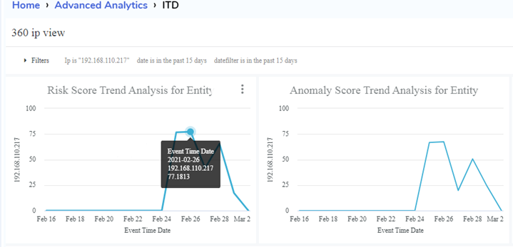
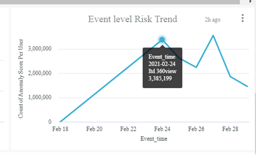
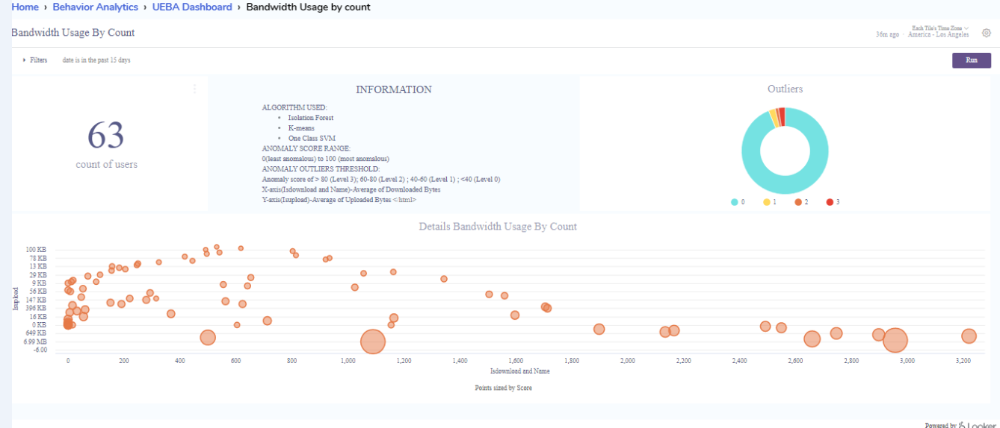

# Elysium Analytics and AI Documentation

## Contents 

## 1. [Key Features Of Elysium Analytics](#KeyFeatures)
	1. Insider Threat Detection 
	2. Privileged Account Usage 
	3. DNS Tunneling
	4. VPN Monitoring
	5. Unusual File Access
	6. Data Exfiltration
	7. Bot Attack 
	8. Unusual File Downloads
	9. Leverage data science platforms (Advanced AI/ML Techniques)
	10. Phishing Attack
	11. New IP Addresses
	12. Build your own Analytical dashboards
## 2. [Quick Start](#quickstart)
	1. After filling the client form
	2. Setup Client access using UI
	3. Setup cloud access
	4. Setup Installation, Services offering
	5. 10 days trail run if any
	6. Request a Demo

## 3. [APP’S Integration](#APPS)
	
1. [360 view](#360view)
1. [Alerts](#alerts)
1. [Endpoint](#endpoint)
1. [ITD (Inside Threat Detection)](#ITD)
1. [Identity Management](#IM)
1. [Operational Dashboards](#operationaldashboard)
1. [Search](#search)
1. [Statistical Data](#statisticaldata)
1. [Security Posture](#securityposture)
1. [Behavior Analytics UEBA](#UEBA)
1. [Snowflake analytics](#snowflakeanalytics)
1. [Source analytics](#sourceanalytics)
1. [SOC Dashboard](#socdashborad)
1. [NIST,HIPAA,SOX](#NIST)

## 4. Inside Threat Detection 
1. [Filters](#filters)
1. [Behaviours of Risky User and Entity(Day wise and aggregation)](#behaviourofrisky)
1. [Anomaly count user/Entity source](#anomalycount)
1. [Threat User’s and Entity](#threatuserentity)
1. [360 User view](#360userviewmain)
1. [360 IP View](#360ipwmain)
1. [Risk score trend analysis for User/ Entity](#riskscoretrendanalysis)
1. [Daily Risky Behavior – Zscores](#dailyriskyzscores)
1. [MITRE-ATTACK and Alerts](#MITREattack)
1. [Event level Risk Trend](#eventlevelrisktrend)
1. [Event List](#eventlist)
 
	 

## 5. Profile (User/Entity anomaly Scores) or UEBA(User and Entity Behavior Analytics)
1. [Endpoint Indicators of Compromise](#endpoint1)
2. [Privileged Account Usage](#previlegedaccount)
3. [High Volume File Access](#highvolumeaccess)
4. [Bandwidth Usage by size and count](#bandwidthsizecount)
5. [VPN Connections](#vpnconnections)
6. [File Downloads](#filedownloads)
7. [Bot Attack](#botattack)
8. [Unusual Domain](#unusualdomain)

## 6. [Build your own Analytical Dashboards](#buildanalytics)
### 1. [looker creation of dashboards](#lookerdashboard)

1. [Creating A New Dashboard in Elysium Analytics](#newdashboard)
1. [Adding new tiles to dashboard](#newtiles)
1. [Looker Explore window to discover new insights](#explore) 
1. [Select the fields and  filters for your query tile’s](fieldsandfilters)
1. [Configure your visualization options](#visualizations)
1. [Adding Dashboard Filters a User Can Change](#usercanchange)
1. [Copy Of Existing Dashboard and Editing the dashboard](#copy1)
1. [Users and Roles of access of dashboards](#userroles)
1. [Dashboards Available in Elysium Analytics](#availabledashboards)

### 2. [Elysium Kibana Data Visualizations](#kibanaviz1) 

### 3. [Build Kiabana Dashboards](#ownml)  

## 7. Alerts
	1. Alerts monitor
	2. Scheduled searches
	3. Alert rules
	4. Alert creation
	5. Alert action
	6. Alert Notification
	7. Alert Dashboards
	8. Drill Down Alerts

## 8. Search

1.Search basics
1.Search query language (KQL)
1.KQL Introduction
1.Search multiple fields
1.Grouped together
1.Terms query
1.Boolean queries
1.Range queries
1.Date range queries
1.Exist queries
1.Wildcard queries
1.Nested field queries (Subqueries)
1.Optimize Search Performance
1.General Search Examples
1.Supported Logs
1.Standard Fields (ODM)
1.Backend snowflake integration, SQL Opendistro query support for Elysium kibana search
1.Save query, search
1.Index Management
1.Create Filters and search 

## 8. Manage and Monitoring
1. Ingestion and Volumes
2. Users and Roles
3. Connections and Integration
4. Data Forwarding

## 9. SIEM (Security Information and Event Management )
1. Hosts
2. Network
3. Endpoint Activity
4. Authentication logs
5. DNS Traffic
6. NetFlow

## 10. Role-Based Access Control
1. Admin Role 
2. Analyst Role 
3. Developer Role 
4. Manger Role 
5. Team Lead Role 
6. Dashboard Access control

## 11. Cloud Integration
1. AWS
2. GCP
3. Azure
## 12. Support Help
1. Community help github
2. Product support 
3. Virtual assistance chatbot

## Details of contents 

# 1. Key features Of Elysium Analytics 
	
	
* Elysium Analytics is a machine learning based log analysis solution for security minded mid-sized to large enterprises, challenged by the volume of security log data today both from an infrastructure as well as an analytics and detection perspective.

* We have simplified onboarding of data, provide a scalable data lake analytics platform, and search on a pay-as-you-go basis . 
* Since we are built on top of Snowflake, our SaaS solution is truly a cloud scale security analytics platform that removes the barriers from ingesting, contextualizing, 	searching, analyzing, and storing log data with a cost effective and low risk service. 
*  Unlike the other log analysis vendors in this market, our SaaS offering is licensed on a usage basis lowering cost and reduces financial risk.  You pay a low price for storage, and compute is billed by the minute of usage.  
* Additionally, we have an open platform with no vendor lock-in, customizable analytics models, as well as APIs for end user development of analytics models. 

* Elysium Analytics provides a single pane of glass through an SOC analyst identifies, observes  aggregated views of all activity of users and entities across an enterprise.
* This is achieved through the use of profilers, perform data sketches across time intervals on security metrics to baseline, behaviours of users and entities, MITRE ATT&CK vectors. 

* To unify the underlying data schema, Elysium Analytics has created an advanced “layered” schema architecture that supports different log vendors  “views” into the same ODM schema. 
* Elysium is committed to providing open security framework deployments with add-ons that enable our customers to utilize analytics created by security framework.

**1. Insider Threat Detection:**

Insider Threat Detection Show users, Entity's deviating from normal behavior and detect statistical anomalies and outliers with unsupervised learning clustering across numerous features, outliers and indicators of compromise threshold values of risk factors.
Elysium ITD detects early indicators of insider threats Users/Entity's, Behaviours,  prevent insider threats,alerting, mitigate their consequences of actions.

**2. Privileged Account Usage:**

Identify privileged users, services, and shared accounts and then monitor them for abnormal usage associated with insider and external attacks.

**3. DNS Tunneling:**

Detect DNS tunneling attacks used for malicious file transfers, payload downloads, or remote access.

**4. VPN Monitoring:**

Profile geo-location of users & endpoints and compute the number of simultaneous VPN connections during any minute of any day to detect unauthorized access.

**5. Unusual File Access:**

Identify excessive and abnormal file activity on endpoints and detect individuals, or malware controlled by attackers, attempting to search for and steal valuable digital assets.

**6. Data Exfiltration:**

Detect unauthorized transfer of data from a user's computer or servers carried out by someone manually or automatically by malware on the network.

**7. Bot Attack:**

Detect bot traffic and attacks in real-time by monitoring high velocity connections and port scans across devices within the corporate network.

**8. Unusual File Downloads:**

Protect your network and  users from malicious content and binaries by detecting downloads from low prevalence and suspicious sites and domains.

**9. Leverage data science platforms (Advanced AI/ML Techniques):**

Build your own ML models on Databricks or other preferred data science platforms to  detect new evolving threats.

**10. Phishing Attack:**

Profile email use patterns and detect unusual and potentially high risk email messages from low prevalence and suspicious domains.

**11. New IP Addresses:**

Protect your network and users from malware downloads, drive-by attacks, and phishing attacks through profiling of new IPs and detection of connections to low prevalence IPs.

**12. Build your own Analytical dashboards:**

Build your own analytics dashboards with Looker or connect to 3rd party applications through our API.

# 3. APP’S Integration  
	
Elysium APP'S Integration 

### 1. 360 view 
	
Elysium offers to show all the information of a user or an entity for Last 30 Days.
Shows login patterns (successful & failed logins) for the last 7 and 30 days for the user/entity in context
Shows all machines access for the last 7 days and 30 days by users and entity’s
Amount of data pushed to web versus his community
Access to any suspicious or dark sites.
Show escalated privileges by user/entity

### 2.	Alerts 

 
Elysium alerts Monitors continuously query your data to monitor and send notifications when specific events occur.
thresholds, critical, warning, and missing data and also gives aggregation based results.

Elysium offers a set of correlation rules and behavioral analytics to alert on specific sequence of events or pattern using machine learning and statistical analysis. 
The alerting feature notifies you when data from one or conditions are met. 
For example, you might want to receive an email if your application logs more than five HTTP 503 errors in one hour, or you might want to page a developer if no new records have been processed in the past 20 minutes.

	
	
### 3.	Endpoint 
Endpoint Dashboard analysis provides traffic and attacks in real-time by monitoring high velocity connections and port scans across devices within the corporate network.
It supports Profile geo-location of users & endpoints and compute the number of simultaneous VPN connections during any minute of any day to detect unauthorized access
1. VPN Monitoring
1. Unusual File Access
1. Data Exfiltration
1. Bot Attack 
### 4.	ITD (Inside Threat Detection) 

 	
Inside Threat Detection identifies abnormal behaviors of user/entity using unsupervised learning algorithms and provides statistical anomalies scores ,outliers and indicators of compromise threshold values of risk factors.

It provides simple dashboards easily understood by users. 
It has scoring:  0 to 60% normal, 60 to 90 as unsafe behavior, and 90% or higher as insider threat. 
By using risk-based Scoring, which performs data sketches across time intervals on security metrics baselining the behaviors of all users and entities,
we gain full visibility into any anomalous and suspicious behavior through risk-based scoring of the security data.

###  5.	Identity Management 
VPN Session dashboard explain about:
1. The name of user connecting and disconnecting,
1. The start and end time of the VPN or administrator sessions,
1. The outside global address from where the user and host connect
1. The inside local address assigned to the user's session.

### 6.	Operational Dashboards 
	
We combine all your on-prem IT logs, enterprise network logs, cloud logs and network traffic data into one scalable data lake and combine your in-cloud and on-prem data silos into one scalable Snowflake data lake. 
We map, parse, and store your data in Elysium Analytics Open Data Model for full context and fast analytics. 
We have an Operational folder in our App where you can find Data Investigation and Data Collection Reports.
	
### 7.	Search 
Kibana is the default visualization tool for data in Elasticsearch. It also supports querying integration interface with snowflake, SQL, Kibana Query Language (KQL).
The Kibana Query Language (KQL) makes it easy to retrieve events from indexes or filter the results based on fields, values and operators and features autocomplete,simple, easy-to-use syntax. 
By placing cursor in the Search field, It will give suggestions to retrive the data as per Index pattern.
Elysium search syntax is based on "pipeline" concept and it uses logical and familiar operators letting you to create ad hoc queries quickly.

### 8.	Statistical Data 
A Statistical dashboard is an information management tool that visually tracks, analyzes and displays metrics and key data points to monitor the user information.
	
### 9.	Security Posture 
The Security Posture dashboard is designed to provide high-level insight into the notable events across all domains of your deployment, suitable for display in a Security Operations Center (SOC). 
This dashboard shows all events from the past 24 hours, along with the trends over the past 24 hours, and provides real-time event information and updates.  
This dashboard is fully customizable and gives a bird’s eye view into all notable events across all domains of security. 
	
### 10.	Behavior Analytics UEBA 
UEBA utilizes machine learning and other advanced analytics to detect threats and simplify the work of technical professionals focused on security. 
Furthermore it offers a signatureless approach for detecting emerging threats with statistical analysis and machine learning.  
Specifically Elysium offers canned UEBA reports that map specific techniques and tactics from MITRE ATT@CK vectors, encoding them into behavior profiles that detect unusual behaviors.

### 11.	Snowflake analytics 
Snowflake audit dashboards can be provided using Advanced Machine learning techniques to provide descriptive statistics of user usage aacount details, identifying abnormal behaviour, anomoly scoring, alerting. 
1. Snowflake audit logs
1. Snowflake login history
1. Alert scoring
1. Timeseries Scroing 
1. Anomaly scores 
	
### 12.	Source analytics 
	
Source Analytics dashboard mainly focuses on windows auditing, security, Network traffic data with what type of events occurred in a day for each host and user.
	
### 13.	SOC Dashboard 
	
Security operations center (SOC) managers can view overall efficiency metrics and measure the individual performance of the SOC team members in the organization. 
This dashboard explains about all key information of the organization.

### 14.	NIST,HIPAA,SOX 
	
### NIST (National Institute of Standards and Technology)
Companies that provide products and services to the government have to follow some policies set by the National Institute of Standards and Technology (NIST). NIST has two common mandates (NIST 800-53 AND NIST 800-171 which companies have to follow.
These are the reports Offered by Elysium.
1. Resource Monitoring
1. Remote Access
1. Trust Relationships 
1. Continuous Monitoring
1. User Access and Least Privileges
1. File Integrity Monitoring
1. Change Control  
1. Boundary Defenses
1. Login and Logoff Monitoring
1. Investigation Reports
1. System Events
1. Email reports
1. Watchguard DHCP Reports
1. Watchguard Proxy Reports 

### HIPAA
HIPAA Deals with health care organizations where data is sensitive and critical. So Elysium offers to collect and analyze the logs with meaningful information in the form of reports.These are the reports Offered by Elysium.
1. Logon and Logoff Monitoring
1. Account Logon
1. System Events
1. Object Access

### SOX IT Compliance

SOX Regulations that mandate accuracy, integrity and security of the company or an organization. 
1. It processes log data which is tedious. To make it easy Elysium offers predefined reports.These are the reports Offered by Elysium.
1. User Logon and Logoff
1. Logon Failure
1. User Access
1. Successful or Unsuccessful Validation & User group changes
1. Continuous Monitoring

## 4. Inside Threat Detection   

Elysium Analytics provides a unique AI-driven security analytics platform that comes with a wide array of advanced ML-based security outcomes and behavioural models to help organizations detect and respond to advanced cyber-attacks. 
1. It Reduces costs of an insider attack 
2. Early detection of insider threat
3. Fast and efficient response to an insider attack. 
4. Alerting and Notfications 
	
Inside Threat Detection identifies abnormal behaviors of user/entity using unsupervised learning algorithms and provides statistical anomalies scores ,outliers and indicators of compromise threshold values of risk factors. 
	
An Elysium insider threat program is  a efficient core part of modern cybersecurity strategy. Elysium ITD controls in place to detect, deter, and respond to insider attacks and inadvertent data leaks is a necessity for any organization that strives to protect its sensitive data. It’s also required by many IT regulations, standards, and laws: NISPOM, NIST, HIPAA, PCI DSS, and others.

Elysium ITD detect insider threats based on 
1. Monitor User/Entity activity
2. Manage User/Entity access to sensitive resources
3. Analyze User/Entity behavior

Elysium Perform a risk assessment based on 

1. Define threat sources 
2. Discover cybersecurity vulnerabilities
3. Create list of high risk employess and high value assests 
4. Estimate the liklihood insider threat based on timeseries of events
5. Determine and assess risk scores
6. Alerting and Notfication to make corresponding actions.

### Overview of the ITD tiles in the Dashboard
### 1.	Filters  

Filters:  User can Change the  Date filter,User filter and RUN the Dashboard
 

Date fillter supports is in the past, is on the day, is in the range, is in the year, is any time, is null, is not null etc.
User filter supports is equal to, contains, starts with, ends with, is not null, is null matches user attribute etc.

	
### 2. Behaviours of Risky User and Entity(Day wise and aggregation)  

User/Entity Count with High Risk Scores
It shows the Score of high risky events
	

	
	
### 3.	Anomaly count user/Entity source 
Anomalous User/Entity by Source
It shows the count of high anomaly score  and source types

	
	
### 4.	Threat User’s and Entity 

Threat Users
It shows data for max score for all Users in Elysium Analytics in the last 15 days
Threat Entities
It shows data for max score for all Entities in Elysium Analytics in the last 15 days

	
	
### 5.	360 User view 
	

Overview of the Tiles in Dashboard
1. Active Directory shows the details of AD User.
1. Risk Score shows the Average of the Risk Score in a weeks time for Source Type -  ML-AGGREGATE
1. Alerts Count shows the count of alerts in a week
1. Number of Assets shows the count of IPs accessed in a week.
1. Aggregates show the Count of Aggregates
1. Risk Score Trend Analysis shows the sum of Risk score per day for 2 weeks for source Type - ML
1. High Risk Analysis shows the sum of events based Anomaly Score 
1. Daily Risky Behavior - Zscores shows the different  Scores for source type - ML in last 15 days
1. MITRE - ATTACK shows details about the Mitre attack for User in past 2 weeks
1. Alerts shows the Count of Alerts per Type.
1. Event Level Risk Trend shows the sum of User Anomaly score for type other than ML in the past 15 days
1. Event List shows the details of events like description, IP, Anomaly score etc.
1. If you click on Src User name or Src IP , you will get different options to drill down and see the details.
	
### 6. 360 IP View  
	
		
	
Filter: User can change the filter and run the dashboard 

Overview of the Tiles in Dashboard

1. Risk Score Trend Analysis for Entity shows the sum of risk score of entity / IP for Src Type ML on a day  in the past 15 days.
1. Anomaly Score Trend Analysis for Entity shows the sum of Anomaly score of entity / IP  for Scr Type ML on a day to the past 15 days.
1. High Risk Events shows the total count per Source Type - Security Auditing , Network traffic etc other than type ML with Anomaly score >=85 in past 15 days
1. Profile Z Score shows the details 
1. Time Series shows Sum of If Dwnld Ts and If Dwnld Val per day for last 15 days for ML
1. Alerts shows Count of Alerts by Alert name
1. Event Level Risk Trend shows the sum of User Anomaly score for type other than ML in the past 15 days
1. Event List gives the details about the Event with Entity anomaly score >=85 and Dst name in the past 15 days

### 7.	Risk score trend analysis for User/ Entity 
	
Anomaly Score Trend Analysis for Entity shows the sum of Anomaly score of entity / IP  for Scr Type ML on a day to the past 15 days.	
	
	
	

	
### 8.	Daily Risky Behavior – Zscores  
Z_score value gives the amount of abnormal deviation of an object (user/enity) from the population by considering its previous behaviour over time series along with other objest behaviour .
Daily Risky Behavior - Zscores shows the different  Scores for source type based machine learning techiques in last 15 days.
Ex: Logins Zscore, Failedlogins Zscore,  If Upld Zscore, If Dwnld Zscore, Fileactivity Zscore, Email Count Zscore

	
	
### 9.	MITRE-ATTACK and Alerts  
MITRE ATT&CK is a framework describing tactics and techniques for how adversaries attack computers and networks.  "ATT&CK" is an abbreviation of "Adversary Tactics and Techniques and Common Knowledge". 
The Enterprise ATT&CK matrix is Elysium's priority interest and focuses primarily on hosts using Microsoft Windows and Microsoft Windows Server operating systems. The Enterprise matrix include techniques applicable to Linux and MacOS hosts also.

Alerts shows Count of Alerts by Alert name
Filter by Alert name will open another dashboard and see the details about the particular Alert
It shows data for max of Total Alert Count,Max of Alert Score,Max of Anomaly Score,Max of Risk Score.They are represented in different colored Bars.

	

	
### 10.	Event level Risk Trend  
Event Level Risk Trend shows the sum of User Anomaly score for type other than ML in the past 15 days	
	
	
### 11.	Event List  
Event List shows the details of events like event Timestamp, src username, description, IP, Anomaly score, in bytes, out bytes, event id,  etc	
	
	
	
	
## 5. Profile (User/Entity anomaly Scores) or UEBA(User and Entity Behavior Analytics) 
	
	
UEBA utilizes Machine Learning and Advanced Artificial Intelligence (AI) analytics to detect threats and simplify the work of technical professionals focused on security. 

Furthermore it offers a signature less approach for detecting emerging threats with statistical analysis, AI and machine learning approaches.   

Elysium UEBA (User and Entity Behavior Analytics) provides solutions for profile users, their peer groups and other entities, employ advanced analytics to detect anomalous transactions,  behaviors and  User/Entity endpoints.

Algorithm,anomaly score range,anomaly outliers threshold, Count of Users,Information,Outliers,Details are common  in all the UEBA’s.They vary with respective UEBA view used and All the tiles in dashboards changes according to the Parameters of the UEBA, Those parameters  appear in the Information tile.

## **Overview of all the UEBA’s**

* Bandwidth Usage by Count shows the Average of Downloaded Bytes,Average of Uploaded Bytes Information.
* Bandwidth Usage by Size shows the Average of Sent Bytes,Received Bytes information.
* EndPoint Indicators of Compromise shows the Average of Sent Bytes,Average of End Point  Remote count Information.
* Privileged Account Usage shows average of bandwidth and average of privileged count information.
* High volume File Access shows average of file access and average of file volume count Information
* VPN CONNECTIONS shows  Avg Distance of Geo-locations between Sessions and  Total no.of sessions information
* File Downloads shows Average of Destination count and Average of Download  Count information.
* Bot attack shows average of source count,average of destination count information.
* Unusual Domain shows the average of uploaded bytes and average of Distinct Domain count information

## User session Tracking information
1. User session Tracking Dashboard has on information related to these below:
1. Bandwidth usage
1. File downloads/uploads
1. Top visited sites
1. Top block sites
1. Cloud Applications
1. Mobile Traffic by Device Type
1. Mobile Traffic by Location
1. Locations
1. Social Networking Applications
1. Streaming Media Application
1. VPN session activity
1. Email Counts & Size.

## **Overview of the Tiles in User session tracking Dashboard**

1.Total Web Traffic Count, Bandwidth (Upload and Download Bytes) and Location of Users for Event Ids 
1. Windows Session Tracking shows the details like Session Start time, End Time, IPs, Description, Duration of the session etc for Windows
1. WatchGuard Session Tracking shows the details like Session Start time, End Time, status, user etc for WatchGuard
1. Top visited Sites shows the details of Domain, Web category, count etc a particular user has accessed in  WGTraffic
1. Overall traffic give you the details like user, IP, Bandwidth etc 
1. Cloud Application will gives you the details such as User name, session start time, Web category etc
1. Top Blocked Sites gives you the details  of the blocked sites a user has access.
1. Streaming Media Application shows the details of category Streaming Media, Entertainment, Internet Telephony etc
1. Social Networking Application shows the details of users who are using Social media like Facebook, Twitter, YouTube, LinkedIn etc
1. Email Count & Size  shows the details of emails.
1. Blocked Transactions gives you details like user name, Domain etc  for web categories like Games, Potentially unwanted software etc or with a message like 'ProxyDeny: 1. HTTP Request categories','ProxyDrop: HTTPS Request categories'

## **Overview of the Tiles in UEBA  Dashboard**

### 1.	Endpoint Indicators of Compromise 
Mobile/Laptop/Desktop Device Malware Scan 
The following Dashboard is the data on all events containing "Symantec".
The data on severity level, user's log/event channel and source information were all compiled in this dashboard

* End points on the Network and Anti malware Scan Status shows the Symantec Endpoint protection client and active directory hostname ,description of the status in the past 7 days
* Fraction of Hosts in various states shows the status ,count of the union of symantec endpoint and active directory Host.
* Summary of Malware Risk Activities shows the Malware,Action and its description,Hostname .
* HostName viruses shows the malware name,host name, count of symantec endpoint protection Client  in the past 7 days.
* Antimalware Software Events shows the names of host,malware,Activities and Counts of file,risk and events in the Symantec End point in the past 7 days.

	
	
### 2.	Privileged Account Usage 
Details View shows the details like source name,source ip ,source geo city,count in the ITD 360 view .
Ip Geo Map shows the locations of the user and the count.
It redirects to the dashboard with Details View,IP GEO MAP changed.These two tiles are filtered  with new user value

	

### 3.	High Volume File Access  
High volume File Access shows average of file access and average of file volume count Information	
	
	
### 4.	Bandwidth Usage by size and count  

* Bandwidth Usage by Count shows the Average of Downloaded Bytes,Average of Uploaded Bytes Information.
* Bandwidth Usage by Size shows the Average of Sent Bytes,Received Bytes information.

	
		
	
### 5.	VPN Connections   

 1. WatchGuard Session Details shows the information Session,User , source  and host in the past 30 days
 2.  Count of WatchGuard Sessions by Device  Shows the Start time of the Session and count of 
      the  sessions per hostname in the past 30 days.Click on the graph Drill into appears.Click 
      on any of the sessions start Date time Hour,Minute or Time Details appear.
3.  Session status shows the status ,count of the Sessions.
4.  Watchguard Session Types shows the type and Count of the Sessions.
5.  More Watchguard Session of the User shows the user name and count of the Sessions.
6.  Locations of the VPN Sessions shows the count of sessions in the locations
7.  Failed Login  shows the Event  occurred information like user name,
    source information,hostname and the notification information in the message in the 
     past 30 days.

			
	
### 6.	File Downloads  
* File Downloads shows Average of Destination count and Average of Download  Count information.	
	
	
### 7.	Bot Attack  
*  Bot attack shows average of source count,average of destination count information.
	
		
	
### 8.	Unusual Domain  

* Unusual Domain shows the average of uploaded bytes and average of Distinct Domain count information	
	

## 6. Build your own Analytical dashboards 

* Elysium  visualize your data into dashboards, combining tables, charts in useful and interesting layouts, aggregations to the axes, filtering data interactively based on logical conditions, choose modes and colors of charts, and place legends and labels.
* This modules explains how to use the Elysium Analytics user interface to create a new dashboard and populate it with visualizations
* A dashboard is essentially a collection of visualizations of tiles, displayed all in one page. It allows to add filters to make the dashboard interactive and rearrange its tiles and shares visualization dashboard to team memebers based on access roles.

## 6.1 looker creation dashboards  

### 1. Creating A New Dashboard in Elysium Analytics 

To create a blank dashboard:

 	1. Click New Dashboard.
	2. Name the Dashboard.
	3. Click Create Dashboard

another option is go to personal folder of Looker after entering the credentials https://elysiumanalyticsstaging.cloud.looker.com/ then click on New dashboard option. 

### 2. Adding new tiles to dashboard 
After creating emptydashboard, editdashboard,  add new tiles to dashboard 

### 3. Looker Explore window to discover new insights  

Adding New Tile opens a menu of Explores. Choose an Explore view to build dashboard based on different types supported dashboards views already existed in elysium analytics.Explore AWS,Azure,graph Test, Insider trading, IOT, Insider threat detection, Marketing, ODM, Redsky, snowfalke Usage,SQL master, sstech, stock details,  system activity, stubhub, Timelines etc.

It contains three modules
1. Filters
2. Visualization
3. Data

### 4. Select the fields and  filters for your query tile’s 

First select data fileter, then choose relevant fields and filters for query tiles to visually analyze the insights of data

### 5. Configure your visualization options 
	
configuration options allows users to change the visualization based on various parameters

1. Create and run your query.
1. Click the Visualization tab to start configuring your visualization options.
1. Select the type of visualization that best displays your data. For more options, click … to the right of the displayed visualization options.
1. Click Edit to configure the visualization option settings, such as naming and arranging chart axes, choosing the position and type of each data series, or 		     modifying the chart color palette.
1. Once you have set up your query, click Run.
1. Click Save to save the query as a tile on your dashboard.
1. Same way we can add  multiple tiles to the dashboard

### 6. Adding Dashboard Filters a User Can Change 

1. Click on Filter to create a new filter. Elysium lists the new filter on the left hand side of the filters pop-up. You can drag and drop the filters to control the       order in which they appear on the dashboard.
2. Enter filter a name.
3. Choose the type of filter you want to create. You are able to create a Date, String, Number or Field filter
4. Add a default value if desired. You can choose a basic default value from the drop-down options, or create a more complex default value based on an advanced match
5. Decide which tiles the filter should be applied to and turn them on. Then, choose the field to which the value of the filter will be applied.
6. For tiles based on merge query results, select the query or queries you want to apply the filter to and turn them on, then select the LookML field to which the filter    value will be applied.
7. In the Filters to Update tab, you can make different filters dependent on the selected filter. To do so:
	* Save your filter, as defined so far.
	* Turn on the switch next to the other filters you want to make dependent on this filter.
8. In the Customize Filter tab, choose the behavior of your filter:
	* Require a filter value to run this dashboard: The user must enter a filter value before the dashboard can be run. 
	* Allow multiple filter values: When this is on, the user can select multiple filter values. When this is off, the user is able to select only a single filter             value.
9. Save your filter

### 7. Copy Of Existing Dashboard and Editing the dashboard 
	
1. Click on Edit Dashboard and Rename Dashboard and start editing it.
1. Add tiles and filters based on the needed to the edited dashboard.

### 8. Users and Roles of access of dashboards 

Organizational data contains more sensitiive information and these kind of  visualization dashboards need to be shared to only intended persons.

1. Personal Folder has all the dashboard built from elysium for personal space.
1. Group Folder we can move dashboards from personal to group so that specific User related can view those dashboards.
1. Shared Dashboards will be accessed by all  the users who has access to Elysium applications.

### 9. Dashboards Available in Elysium Analytics 
	1. Insider Threat Detection
	2. Security Posture
	3. UEBA
	4. Alerts
	5. 360 View Matters
	6. SOC Dashboard
	7. Statistical Dashboard
	8. SOX IT Compliance
	9. HIPAA
	10. NIST
	11. Operational Dashboards
	12. Source Analytics Dashboard
	13. Identity Management 
	14. User session Tracking information
	15. Active Sync and Outlook Web Access

## 6.2 Elysium kibana data visualizations  

To create a visualization:

1. Click on Visualize in the side navigation.
1. Click the Create new visualization button or the + button.
1. Choose the visualization type:

|Basic charts|
 |:-----------:|:-----------:| 
|Line, Area and Bar charts| Compare different series in X/Y charts|
 
|Heat maps |Shade cells within a matrix|

|Pie chart | Display each source’s contribution to a total|

1. Specify a search query to retrieve the data for your visualization
   * To enter new search criteria, select the index pattern for the indices that contain the data you want to visualize. This opens the visualization builder with a           wildcard query that matches all of the documents in the selected indices.
   * To build a visualization from a saved search, click the name of the saved search you want to use. This opens the visualization builder and loads the selected query.

## 6.3 Build own ML Models using data bricks   

			
## 6. Alerts tiles

Overview of alert  tiles in the Dashboard

1.  New Alerts  
     It shows the everyday count of alerts.Click on the graph  Show All,Drill appears
     Click on Drill into any of the event time  it takes to the Details.
2.  New Alerts By Severity 
     It shows the count of alerts per severity.Low,high Critical are level of Severity.Click on 
     the graph Show All, Filter By Severity appears.Click on Filter By Severity it redirects
     to Dashboard with severity value as filter.
3.  New Alerts By Type 
     It shows the count of alerts according to the alert names.Different colored bars represent
     to  the  respective alert abbreviation names .Click on the graph Show All,
     Filter By Alert name appears. Click on the Filter By Alert name it filters with the alert_name.
4.  Alerts By Source 
     It shows the count of alerts according to the source names.Different colored lines 
     represent the respective Source names .
5.  Alerts Origination From Geo 
     It shows the count of Alerts per Location.
6.  Alert  types for last 7 days
     It  shows the different alerts types,count of alerts and alerts generated date. Click on graph 
     Filter By Alert Name  appears. Click on Filter By Alert Name it redirects to the Dashboard by 
     filtering  alert name.
7.  User Alerts for 7 days 
     It shows the name of the user,count of alerts,alerts generated date.
8.  Alerts Data 
     It shows the information of count of alerts,alert type,description,alert abbreviation name,
     user name ,event time minute and total count of alerts.
9.  Detailed View 
     It shows information about  alerts,ID,Parent Alert ID,user name,source,IP’ s of both source 
     and destination, Hostname
 

## 7. Statistical Data / Information

Filter: User can change the filter and run the dashboard 

Overview of the Tiles in Dashboard

City shows the Count of Events per City
Total Activity Per Region shows the total Events / Activities per City per day
Bandwidth Usage/City shows the  Total uploaded and downloaded bytes per City
Top 10 Users/ Bandwidth shows the first 10 users who used the most Bandwidth (sum of uploaded and downloaded bytes)
Details shows the details of a particular user / system like Name, City, Event Date, Successful Login, Number of Emails etc.
If you hover over (1-4) tiles, you can see the details like Event Date, City, Bandwidth etc

# 7.  SOC Dashboard
 
Overview of the Tiles in Dashboard

1. Top 10 Alerts shows the count of highest Alerts Types
1. Top Alerts last 48 hours shows the list of users / system with high Alert count with Alert abbreviation name (Alert Type)
1.Alert Count shows the Total count of Alerts.
1. Events Count shows the Total Ingested count
	(1-4) Tiles shows the data in the past 2 days
1. Data Source loading over the last 7 days shows the sum of Ingested count per Source 
1. Top 10 bandwidth Usage shows top 10 users who has uploaded or downloaded the highest amount(Bytes) of data
1. Top 10 Risky Entities shows the high Risk entities
1. Top 10 Risky Users shows the  high Risk Users
1. UEBA’s Sparkline shows the maximum score of the Reports 
	Tiles (5,6 & 9) shows last 7 days of data
	Tiles (7 & 8) shows last 15 days of data with Risk Score >=50
 

