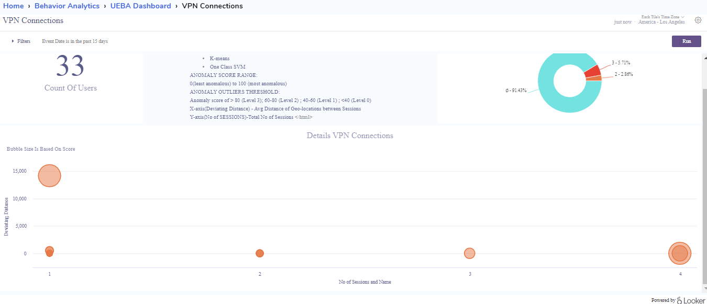
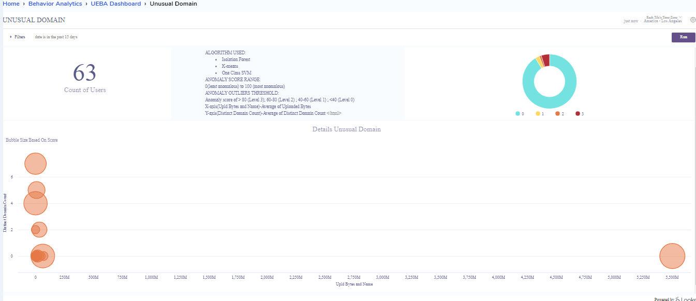
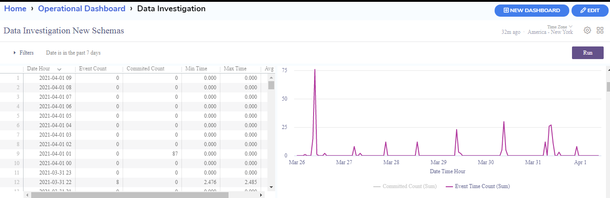

# Elysium Analytics and AI Documentation

## Contents 

## 1. [Key Features Of Elysium Analytics](#KeyFeatures)
	1. Insider Threat Detection 
	2. Privileged Account Usage 
	3. DNS Tunneling
	4. VPN Monitoring
	5. Unusual File Access
	6. Data Exfiltration
	7. Bot Attack 
	8. Unusual File Downloads
	9. Leverage data science platforms (Advanced AI/ML Techniques)
	10. Phishing Attack
	11. New IP Addresses
	12. Build your own Analytical dashboards
## 2. [Quick Start of Elysium](#quickstart)
1. [Fill the client form and Request a Demo of Elysium Product](#qsclientform)
2. [Setup Client access using AWS Demo cloud](#qsawsdemoaccess)
3. [Providing major functional services  of Elysium](#qsfunctionalservices)
	* [Elysium Data Connectors and data ingestion](#qsconnectors)
	* [Operational](#qsoperational)
	* [search for log data](#qssearch)
	* [Security](#qsecurity)
	* [Behavior Analytics](#qsbehaviour)
	* [ML and ITD UI Dashboards](#qsmlitd)
	* [Compilances](#qscomplilances)
	* [Alerts](#qsalerts)
4. [Create,modify,Share custom dashboards](#qscreatemodifydashboard) 
5. [Elysium Resources and Datasheets](#qsresourcesdatasheet)
6. [Get Help](#qsgethelp)

## 3. [APP’S Integration](#APPS)
	
1. [360 view](#360view)
1. [Alerts](#alerts)
1. [Endpoint](#endpoint)
1. [ITD (Inside Threat Detection)](#ITD)
1. [Identity Management](#IM)
1. [Operational Dashboards](#operationaldashboard)
1. [Search](#search)
1. [Statistical Data](#statisticaldata)
1. [Security Posture](#securityposture)
1. [Behavior Analytics UEBA](#UEBA)
1. [Snowflake analytics](#snowflakeanalytics)
1. [Source analytics](#sourceanalytics)
1. [SOC Dashboard](#socdashborad)
1. [NIST,HIPAA,SOX](#NIST)

## 4. Inside Threat Detection 
1. [Filters](#filters)
1. [Behaviours of Risky User and Entity(Day wise and aggregation)](#behaviourofrisky)
1. [Anomaly count user/Entity source](#anomalycount)
1. [Threat User’s and Entity](#threatuserentity)
1. [360 User view](#360userviewmain)
1. [360 IP View](#360ipwmain)
1. [Risk score trend analysis for User/ Entity](#riskscoretrendanalysis)
1. [Daily Risky Behavior – Zscores](#dailyriskyzscores)
1. [MITRE-ATTACK and Alerts](#MITREattack)
1. [Event level Risk Trend](#eventlevelrisktrend)
1. [Event List](#eventlist)
 
	 

## 5. Profile (User/Entity anomaly Scores) or UEBA(User and Entity Behavior Analytics)
1. [Endpoint Indicators of Compromise](#endpoint1)
2. [Privileged Account Usage](#previlegedaccount)
3. [High Volume File Access](#highvolumeaccess)
4. [Bandwidth Usage by size and count](#bandwidthsizecount)
5. [VPN Connections](#vpnconnections)
6. [File Downloads](#filedownloads)
7. [Bot Attack](#botattack)
8. [Unusual Domain](#unusualdomain)


## 6. [Build your own Analytical Dashboards](#buildanalytics)
### 6.1. [looker creation of dashboards](#lookerdashboard)

1. [Creating A New Dashboard in Elysium Analytics](#newdashboard)
1. [Adding new tiles to dashboard](#newtiles)
1. [Looker Explore window to discover new insights](#explore) 
1. [Select the fields and  filters for your query tile’s](fieldsandfilters)
1. [Configure your visualization options](#visualizations)
1. [Adding Dashboard Filters a User Can Change](#usercanchange)
1. [Copy Of Existing Dashboard and Editing the dashboard](#copy1)
1. [Users and Roles of access of dashboards](#userroles)
1. [Dashboards Available in Elysium Analytics](#availabledashboards)

### 6.2. [Elysium Kibana Data Visualizations](#kibanaviz1) 

### 6.3. [Build Kiabana Dashboards](#mainkibanadashboard)  
1. [Visualize your data with dashboards](#yourdashboard)
1. [Open the dashboard](#opendashboard)
1. [Create panels](#createpanels)
1. [clone panels](#clonepanels)
1. [Explore the underlying documents](#exploredocuments)
1. [Download panel data as CSV](#downloadpanel)
1. [Share the dashboard](#sharedashboard)
1. [Export the dashboard](#exportdashboard)


## 7. Data Collection and Ingestion 

1. [Collect your data/Shippers](#shippers)
2. [Connectors and plugins](#connectyourdata)
3. [Parsing data](#parsedata)
4. [Enrich data](#enrichdata)
5. [Load data to datalake](#loaddata)
6. [Add Threat intelligence to your data](#addthreat)
7. [Cloud Apps](#cloudapps)
8. [Data Investigation Dashboards](#investigationdashboard)
9. [Data Ingestion tracking](#ingestiontracking)
10. [Logstash Network Traffic Dashboards](#LogstashNetwork)

## 8. Alerts
1. [Alerts monitoring](#alertmonitoring)
2. [Alerts by Severity,Type, Source](#AlertsbySeverityTypeSource)
3. [Alert Filters by Users/Entity's based on Time Intervals](#alertuserenity) 
	* [Top 10 Risky Users and Enity's](#toprisky)
4. [Alert rules](#alertrules)
5. [Alert Dashboards](#alertdashboard)
6. [Alert creation and manage alert rules](#alertcreationandmanagement)
	* [Behaviour Based](#behaviouralerts)
	* [Aggregate Based](#AggregateBased)
	* [Time Series](#timeseriesalerts)
	* [Profilebased](#Profilebased)
	* [Rulebased](#Rulebased)
	* [Custom alert Creation](#customalert)
	* [Alert 1.75](#alert75)

7. [Alert action](#alertaction)
8. [Alert Notification](#alertnotification)
9. [Drill Down Alerts](#drilldownalerts)
10. [Report Scheduler](#Scheduledsearches)
	

## 9. Elysium Search User Guide
## Overview
1.	[Search basics](#Searchbasics)
2.	[Search query language (KQL)](#KQL)
	* [KQL Introduction](#kqlintroduction)
	* [Preliminary Basics and search rules](#preliminaryBasicsandsearchrules)
	* [Search multiple fields](#Searchmutiplefields)
	* [Grouped together](#groupedtogether)
	* [Terms query](#termquery)
	* [Boolean queries](#booleanqueries)
	* [Range queries](#rangequeries)
	* [Date range queries](#daterangequeries)
	* [Exist queries](#existqueries)
	* [Wildcard queries](#wildcardqueries)
	* [Nested field queries (Subqueries)](#nestedfieldqueries)
3.	[Optimize Search Performance](#optimizesearchperformance)
4.	[General Search Examples](#generalsearchexamples)
5.	[Supported Logs](#supportedlogs)
6. 	[Standard Fields (ODM)](#standardfields)
7.	[Backend snowflake integration, SQL Opendistro query support for Elysium kibana search](#snowflake)
8.	[Save query, search](#savequerysearch)
9.	[Index Management](#indexmanagement)
10.	[Create Filters](#createfilter) 

## 8. Manage and Monitoring
1. Ingestion and Volumes
2. Users and Roles
3. Connections and Integration
4. Data Forwarding

## 9. SIEM (Security Information and Event Management )
1. Hosts
2. Network
3. Endpoint Activity
4. Authentication logs
5. DNS Traffic
6. NetFlow

## 10. Role-Based Access Control
1. Admin Role 
2. Analyst Role 
3. Developer Role 
4. Manger Role 
5. Team Lead Role 
6. Dashboard Access control

## 11. Cloud Integration
1. AWS
2. GCP
3. Azure
## 12. Support Help
1. Community help github
2. Product support 
3. Virtual assistance chatbot


## Details of contents 


# 1. Key features Of Elysium Analytics <span id="KeyFeatures"><span>
	
	
* Elysium Analytics is a machine learning based log analysis solution for security minded mid-sized to large enterprises, challenged by the volume of security log data today both from an infrastructure as well as an analytics and detection perspective.

* We have simplified onboarding of data, provide a scalable data lake analytics platform, and search on a pay-as-you-go basis . 
* Since we are built on top of Snowflake, our SaaS solution is truly a cloud scale security analytics platform that removes the barriers from ingesting, contextualizing, 	searching, analyzing, and storing log data with a cost effective and low risk service. 
*  Unlike the other log analysis vendors in this market, our SaaS offering is licensed on a usage basis lowering cost and reduces financial risk.  You pay a low price for storage, and compute is billed by the minute of usage.  
* Additionally, we have an open platform with no vendor lock-in, customizable analytics models, as well as APIs for end user development of analytics models. 


* Elysium Analytics provides a single pane of glass through an SOC analyst identifies, observes  aggregated views of all activity of users and entities across an enterprise.
* This is achieved through the use of profilers, perform data sketches across time intervals on security metrics to baseline, behaviours of users and entities, MITRE ATT&CK vectors. 

* To unify the underlying data schema, Elysium Analytics has created an advanced “layered” schema architecture that supports different log vendors  “views” into the same ODM schema. 
* Elysium is committed to providing open security framework deployments with add-ons that enable our customers to utilize analytics created by security framework.

**1. Insider Threat Detection:**

Insider Threat Detection Show users, Entity's deviating from normal behavior and detect statistical anomalies and outliers with unsupervised learning clustering across numerous features, outliers and indicators of compromise threshold values of risk factors.
Elysium ITD detects early indicators of insider threats Users/Entity's, Behaviours,  prevent insider threats,alerting, mitigate their consequences of actions.

**2. Privileged Account Usage:**

Identify privileged users, services, and shared accounts and then monitor them for abnormal usage associated with insider and external attacks.

**3. DNS Tunneling:**

Detect DNS tunneling attacks used for malicious file transfers, payload downloads, or remote access.

**4. VPN Monitoring:**

Profile geo-location of users & endpoints and compute the number of simultaneous VPN connections during any minute of any day to detect unauthorized access.

**5. Unusual File Access:**

Identify excessive and abnormal file activity on endpoints and detect individuals, or malware controlled by attackers, attempting to search for and steal valuable digital assets.

**6. Data Exfiltration:**

Detect unauthorized transfer of data from a user's computer or servers carried out by someone manually or automatically by malware on the network.

**7. Bot Attack:**

Detect bot traffic and attacks in real-time by monitoring high velocity connections and port scans across devices within the corporate network.

**8. Unusual File Downloads:**

Protect your network and  users from malicious content and binaries by detecting downloads from low prevalence and suspicious sites and domains.

**9. Leverage data science platforms (Advanced AI/ML Techniques):**

Build your own ML models on Databricks or other preferred data science platforms to  detect new evolving threats.


**10. Phishing Attack:**

Profile email use patterns and detect unusual and potentially high risk email messages from low prevalence and suspicious domains.

**11. New IP Addresses:**

Protect your network and users from malware downloads, drive-by attacks, and phishing attacks through profiling of new IPs and detection of connections to low prevalence IPs.

**12. Build your own Analytical dashboards:**

Build your own analytics dashboards with Looker or connect to 3rd party applications through our API.

	
	
#2.Quick Start of Elysium  <span id="quickstart"><span>
	
1. Fill the client form and Request a Demo of Elysium Product <span id="qsclientform"><span>
	

	
2. Setup Client access using AWS Demo cloud <span id="qsawsdemoaccess"><span>
3. Providing major functional services  of Elysium  <span id="qsfunctionalservices"><span>
	* Elysium Data Connectors <span id="qsconnectors"><span>
	* Operational <span id="qsoperational"><span>
	* search for log data <span id="qssearch"><span>
	* Security(#qsecurity) <span id="qsecurity"><span>
	* Behavior Analytics <span id="qsbehaviour"><span>
	* ML and ITD UI Dashboards <span id="qsmlitd"><span>
	* Compilances  <span id="qscomplilances"><span>
	* Alerts <span id="qsalerts"><span>
4. Create,modify,Share custom dashboards <span id="qscreatemodifydashboard"><span>
5. Elysium Resources and Datasheets <span id="qsresourcesdatasheet"><span>
6. Get Help  <span id="qsgethelp"><span>
	

# 3. APP’S Integration  <span id="APPS"><span>
	
Elysium APP'S Integration 


### 1. 360 view <span id="360view"><span>
	
Elysium offers to show all the information of a user or an entity for Last 30 Days.
Shows login patterns (successful & failed logins) for the last 7 and 30 days for the user/entity in context
Shows all machines access for the last 7 days and 30 days by users and entity’s
Amount of data pushed to web versus his community
Access to any suspicious or dark sites.
Show escalated privileges by user/entity

### 2.	Alerts <span id="alerts"><span>
<p style='text-align: justify;'> 
Elysium alerts Monitors continuously query your data to monitor and send notifications when specific events occur.
thresholds, critical, warning, and missing data and also gives aggregation based results.

Elysium offers a set of correlation rules and behavioral analytics to alert on specific sequence of events or pattern using machine learning and statistical analysis. 
The alerting feature notifies you when data from one or conditions are met. 
For example, you might want to receive an email if your application logs more than five HTTP 503 errors in one hour, or you might want to page a developer if no new records have been processed in the past 20 minutes.
</p>	
	
### 3.	Endpoint <span id="endpoint"><span>
Endpoint Dashboard analysis provides traffic and attacks in real-time by monitoring high velocity connections and port scans across devices within the corporate network.
It supports Profile geo-location of users & endpoints and compute the number of simultaneous VPN connections during any minute of any day to detect unauthorized access
1. VPN Monitoring
1. Unusual File Access
1. Data Exfiltration
1. Bot Attack 
### 4.	ITD (Inside Threat Detection) <span id="ITD"><span>
<p style='text-align: justify;'> 	
Inside Threat Detection identifies abnormal behaviors of user/entity using unsupervised learning algorithms and provides statistical anomalies scores ,outliers and indicators of compromise threshold values of risk factors.

It provides simple dashboards easily understood by users. 
It has scoring:  0 to 60% normal, 60 to 90 as unsafe behavior, and 90% or higher as insider threat. 
By using risk-based Scoring, which performs data sketches across time intervals on security metrics baselining the behaviors of all users and entities,
we gain full visibility into any anomalous and suspicious behavior through risk-based scoring of the security data.
</p>

###  5.	Identity Management <span id="IM"><span>
VPN Session dashboard explain about:
1. The name of user connecting and disconnecting,
1. The start and end time of the VPN or administrator sessions,
1. The outside global address from where the user and host connect
1. The inside local address assigned to the user's session.

### 6.	Operational Dashboards <span id="operationaldashboard"><span>
	
We combine all your on-prem IT logs, enterprise network logs, cloud logs and network traffic data into one scalable data lake and combine your in-cloud and on-prem data silos into one scalable Snowflake data lake. 
We map, parse, and store your data in Elysium Analytics Open Data Model for full context and fast analytics. 
We have an Operational folder in our App where you can find Data Investigation and Data Collection Reports.
	
### 7.	Search <span id="search"><span>
Kibana is the default visualization tool for data in Elasticsearch. It also supports querying integration interface with snowflake, SQL, Kibana Query Language (KQL).
The Kibana Query Language (KQL) makes it easy to retrieve events from indexes or filter the results based on fields, values and operators and features autocomplete,simple, easy-to-use syntax. 
By placing cursor in the Search field, It will give suggestions to retrive the data as per Index pattern.
Elysium search syntax is based on "pipeline" concept and it uses logical and familiar operators letting you to create ad hoc queries quickly.

### 8.	Statistical Data <span id="statisticaldata"><span>
A Statistical dashboard is an information management tool that visually tracks, analyzes and displays metrics and key data points to monitor the user information.
	
### 9.	Security Posture <span id="securityposture"><span>
The Security Posture dashboard is designed to provide high-level insight into the notable events across all domains of your deployment, suitable for display in a Security Operations Center (SOC). 
This dashboard shows all events from the past 24 hours, along with the trends over the past 24 hours, and provides real-time event information and updates.  
This dashboard is fully customizable and gives a bird’s eye view into all notable events across all domains of security. 
	
### 10.	Behavior Analytics UEBA <span id="UEBA"><span>
UEBA utilizes machine learning and other advanced analytics to detect threats and simplify the work of technical professionals focused on security. 
Furthermore it offers a signatureless approach for detecting emerging threats with statistical analysis and machine learning.  
Specifically Elysium offers canned UEBA reports that map specific techniques and tactics from MITRE ATT@CK vectors, encoding them into behavior profiles that detect unusual behaviors.

### 11.	Snowflake analytics <span id="snowflakeanalytics"><span>
Snowflake audit dashboards can be provided using Advanced Machine learning techniques to provide descriptive statistics of user usage aacount details, identifying abnormal behaviour, anomoly scoring, alerting. 
1. Snowflake audit logs
1. Snowflake login history
1. Alert scoring
1. Timeseries Scroing 
1. Anomaly scores 
	
### 12.	Source analytics <span id="sourceanalytics"><span>
	
Source Analytics dashboard mainly focuses on windows auditing, security, Network traffic data with what type of events occurred in a day for each host and user.
	
### 13.	SOC Dashboard <span id="socdashborad"><span>
	
Security operations center (SOC) managers can view overall efficiency metrics and measure the individual performance of the SOC team members in the organization. 
This dashboard explains about all key information of the organization.

### 14.	NIST,HIPAA,SOX <span id="NIST"><span>
	
### NIST (National Institute of Standards and Technology)
Companies that provide products and services to the government have to follow some policies set by the National Institute of Standards and Technology (NIST). NIST has two common mandates (NIST 800-53 AND NIST 800-171 which companies have to follow.
These are the reports Offered by Elysium.
1. Resource Monitoring
1. Remote Access
1. Trust Relationships 
1. Continuous Monitoring
1. User Access and Least Privileges
1. File Integrity Monitoring
1. Change Control  
1. Boundary Defenses
1. Login and Logoff Monitoring
1. Investigation Reports
1. System Events
1. Email reports
1. Watchguard DHCP Reports
1. Watchguard Proxy Reports 

### HIPAA
HIPAA Deals with health care organizations where data is sensitive and critical. So Elysium offers to collect and analyze the logs with meaningful information in the form of reports.These are the reports Offered by Elysium.
1. Logon and Logoff Monitoring
1. Account Logon
1. System Events
1. Object Access

### SOX IT Compliance

SOX Regulations that mandate accuracy, integrity and security of the company or an organization. 
1. It processes log data which is tedious. To make it easy Elysium offers predefined reports.These are the reports Offered by Elysium.
1. User Logon and Logoff
1. Logon Failure
1. User Access
1. Successful or Unsuccessful Validation & User group changes
1. Continuous Monitoring


## 4. Inside Threat Detection   <span id="ITD"><span>

Elysium Analytics provides a unique AI-driven security analytics platform that comes with a wide array of advanced ML-based security outcomes and behavioural models to help organizations detect and respond to advanced cyber-attacks. 
1. It Reduces costs of an insider attack 
2. Early detection of insider threat
3. Fast and efficient response to an insider attack. 
4. Alerting and Notfications 
	
Inside Threat Detection identifies abnormal behaviors of user/entity using unsupervised learning algorithms and provides statistical anomalies scores ,outliers and indicators of compromise threshold values of risk factors. 
	
An Elysium insider threat program is  a efficient core part of modern cybersecurity strategy. Elysium ITD controls in place to detect, deter, and respond to insider attacks and inadvertent data leaks is a necessity for any organization that strives to protect its sensitive data. It’s also required by many IT regulations, standards, and laws: NISPOM, NIST, HIPAA, PCI DSS, and others.

Elysium ITD detect insider threats based on 
1. Monitor User/Entity activity
2. Manage User/Entity access to sensitive resources
3. Analyze User/Entity behavior

Elysium Perform a risk assessment based on 

1. Define threat sources 
2. Discover cybersecurity vulnerabilities
3. Create list of high risk employess and high value assests 
4. Estimate the liklihood insider threat based on timeseries of events
5. Determine and assess risk scores
6. Alerting and Notfication to make corresponding actions.

### Overview of the ITD tiles in the Dashboard
### 1.	Filters  <span id="filters"><span>

Filters:  User can Change the  Date filter,User filter and RUN the Dashboard
 

Date fillter supports is in the past, is on the day, is in the range, is in the year, is any time, is null, is not null etc.
User filter supports is equal to, contains, starts with, ends with, is not null, is null matches user attribute etc.


	
### 2. Behaviours of Risky User and Entity(Day wise and aggregation)  <span id="behaviourofrisky"><span>

User/Entity Count with High Risk Scores
It shows the Score of high risky events
	

	
	
### 3.	Anomaly count user/Entity source <span id="anomalycount"><span>
Anomalous User/Entity by Source
It shows the count of high anomaly score  and source types


	
	
### 4.	Threat User’s and Entity <span id="threatuserentity"><span>

Threat Users
It shows data for max score for all Users in Elysium Analytics in the last 15 days
Threat Entities
It shows data for max score for all Entities in Elysium Analytics in the last 15 days


	
	
### 5.	360 User view <span id="360userviewmain"><span>
	


Overview of the Tiles in Dashboard
1. Active Directory shows the details of AD User.
1. Risk Score shows the Average of the Risk Score in a weeks time for Source Type -  ML-AGGREGATE
1. Alerts Count shows the count of alerts in a week
1. Number of Assets shows the count of IPs accessed in a week.
1. Aggregates show the Count of Aggregates
1. Risk Score Trend Analysis shows the sum of Risk score per day for 2 weeks for source Type - ML
1. High Risk Analysis shows the sum of events based Anomaly Score 
1. Daily Risky Behavior - Zscores shows the different  Scores for source type - ML in last 15 days
1. MITRE - ATTACK shows details about the Mitre attack for User in past 2 weeks
1. Alerts shows the Count of Alerts per Type.
1. Event Level Risk Trend shows the sum of User Anomaly score for type other than ML in the past 15 days
1. Event List shows the details of events like description, IP, Anomaly score etc.
1. If you click on Src User name or Src IP , you will get different options to drill down and see the details.
	
### 6. 360 IP View  <span id="360ipmain"><span>
	
		
	
Filter: User can change the filter and run the dashboard 

Overview of the Tiles in Dashboard

1. Risk Score Trend Analysis for Entity shows the sum of risk score of entity / IP for Src Type ML on a day  in the past 15 days.
1. Anomaly Score Trend Analysis for Entity shows the sum of Anomaly score of entity / IP  for Scr Type ML on a day to the past 15 days.
1. High Risk Events shows the total count per Source Type - Security Auditing , Network traffic etc other than type ML with Anomaly score >=85 in past 15 days
1. Profile Z Score shows the details 
1. Time Series shows Sum of If Dwnld Ts and If Dwnld Val per day for last 15 days for ML
1. Alerts shows Count of Alerts by Alert name
1. Event Level Risk Trend shows the sum of User Anomaly score for type other than ML in the past 15 days
1. Event List gives the details about the Event with Entity anomaly score >=85 and Dst name in the past 15 days


### 7.	Risk score trend analysis for User/ Entity <span id="riskscoretrendanalysis"><span>
	
Anomaly Score Trend Analysis for Entity shows the sum of Anomaly score of entity / IP  for Scr Type ML on a day to the past 15 days.	
	
	
	

	
### 8.	Daily Risky Behavior – Zscores  <span id="dailyriskyzscores"><span>
Z_score value gives the amount of abnormal deviation of an object (user/enity) from the population by considering its previous behaviour over time series along with other objest behaviour .
Daily Risky Behavior - Zscores shows the different  Scores for source type based machine learning techiques in last 15 days.
Ex: Logins Zscore, Failedlogins Zscore,  If Upld Zscore, If Dwnld Zscore, Fileactivity Zscore, Email Count Zscore


	
	
### 9.	MITRE-ATTACK and Alerts  <span id="MITREattack"><span>
MITRE ATT&CK is a framework describing tactics and techniques for how adversaries attack computers and networks.  "ATT&CK" is an abbreviation of "Adversary Tactics and Techniques and Common Knowledge". 
The Enterprise ATT&CK matrix is Elysium's priority interest and focuses primarily on hosts using Microsoft Windows and Microsoft Windows Server operating systems. The Enterprise matrix include techniques applicable to Linux and MacOS hosts also.

Alerts shows Count of Alerts by Alert name
Filter by Alert name will open another dashboard and see the details about the particular Alert
It shows data for max of Total Alert Count,Max of Alert Score,Max of Anomaly Score,Max of Risk Score.They are represented in different colored Bars.

	

	
### 10.	Event level Risk Trend  <span id="eventlevelrisktrend"><span>
Event Level Risk Trend shows the sum of User Anomaly score for type other than ML in the past 15 days	
	
	
### 11.	Event List  <span id="eventlist"><span>
Event List shows the details of events like event Timestamp, src username, description, IP, Anomaly score, in bytes, out bytes, event id,  etc	
	
	
	
	
## 5. Profile (User/Entity anomaly Scores) or UEBA(User and Entity Behavior Analytics) <span id="UEBA"><span>
	
	
UEBA utilizes Machine Learning and Advanced Artificial Intelligence (AI) analytics to detect threats and simplify the work of technical professionals focused on security. 

Furthermore it offers a signature less approach for detecting emerging threats with statistical analysis, AI and machine learning approaches.   

Elysium UEBA (User and Entity Behavior Analytics) provides solutions for profile users, their peer groups and other entities, employ advanced analytics to detect anomalous transactions,  behaviors and  User/Entity endpoints.

Algorithm,anomaly score range,anomaly outliers threshold, Count of Users,Information,Outliers,Details are common  in all the UEBA’s.They vary with respective UEBA view used and All the tiles in dashboards changes according to the Parameters of the UEBA, Those parameters  appear in the Information tile.


## **Overview of all the UEBA’s**

* Bandwidth Usage by Count shows the Average of Downloaded Bytes,Average of Uploaded Bytes Information.
* Bandwidth Usage by Size shows the Average of Sent Bytes,Received Bytes information.
* EndPoint Indicators of Compromise shows the Average of Sent Bytes,Average of End Point  Remote count Information.
* Privileged Account Usage shows average of bandwidth and average of privileged count information.
* High volume File Access shows average of file access and average of file volume count Information
* VPN CONNECTIONS shows  Avg Distance of Geo-locations between Sessions and  Total no.of sessions information
* File Downloads shows Average of Destination count and Average of Download  Count information.
* Bot attack shows average of source count,average of destination count information.
* Unusual Domain shows the average of uploaded bytes and average of Distinct Domain count information


## User session Tracking information
1. User session Tracking Dashboard has on information related to these below:
1. Bandwidth usage
1. File downloads/uploads
1. Top visited sites
1. Top block sites
1. Cloud Applications
1. Mobile Traffic by Device Type
1. Mobile Traffic by Location
1. Locations
1. Social Networking Applications
1. Streaming Media Application
1. VPN session activity
1. Email Counts & Size.

## **Overview of the Tiles in User session tracking Dashboard**

1.Total Web Traffic Count, Bandwidth (Upload and Download Bytes) and Location of Users for Event Ids 
1. Windows Session Tracking shows the details like Session Start time, End Time, IPs, Description, Duration of the session etc for Windows
1. WatchGuard Session Tracking shows the details like Session Start time, End Time, status, user etc for WatchGuard
1. Top visited Sites shows the details of Domain, Web category, count etc a particular user has accessed in  WGTraffic
1. Overall traffic give you the details like user, IP, Bandwidth etc 
1. Cloud Application will gives you the details such as User name, session start time, Web category etc
1. Top Blocked Sites gives you the details  of the blocked sites a user has access.
1. Streaming Media Application shows the details of category Streaming Media, Entertainment, Internet Telephony etc
1. Social Networking Application shows the details of users who are using Social media like Facebook, Twitter, YouTube, LinkedIn etc
1. Email Count & Size  shows the details of emails.
1. Blocked Transactions gives you details like user name, Domain etc  for web categories like Games, Potentially unwanted software etc or with a message like 'ProxyDeny: 1. HTTP Request categories','ProxyDrop: HTTPS Request categories'


## **Overview of the Tiles in UEBA  Dashboard**


### 1.	Endpoint Indicators of Compromise <span id="endpoint1"><span>
Mobile/Laptop/Desktop Device Malware Scan 
The following Dashboard is the data on all events containing "Symantec".
The data on severity level, user's log/event channel and source information were all compiled in this dashboard


* End points on the Network and Anti malware Scan Status shows the Symantec Endpoint protection client and active directory hostname ,description of the status in the past 7 days
* Fraction of Hosts in various states shows the status ,count of the union of symantec endpoint and active directory Host.
* Summary of Malware Risk Activities shows the Malware,Action and its description,Hostname .
* HostName viruses shows the malware name,host name, count of symantec endpoint protection Client  in the past 7 days.
* Antimalware Software Events shows the names of host,malware,Activities and Counts of file,risk and events in the Symantec End point in the past 7 days.


	
	
### 2.	Privileged Account Usage <span id="previlegedaccount"><span>
Details View shows the details like source name,source ip ,source geo city,count in the ITD 360 view .
Ip Geo Map shows the locations of the user and the count.
It redirects to the dashboard with Details View,IP GEO MAP changed.These two tiles are filtered  with new user value

	


### 3.	High Volume File Access  <span id="highvolumeaccess"><span>
High volume File Access shows average of file access and average of file volume count Information	
	
	
### 4.	Bandwidth Usage by size and count  <span id="bandwidthsizecount"><span>

* Bandwidth Usage by Count shows the Average of Downloaded Bytes,Average of Uploaded Bytes Information.
* Bandwidth Usage by Size shows the Average of Sent Bytes,Received Bytes information.

	
		
	
### 5.	VPN Connections   <span id="vpnconnections"><span>

 1. WatchGuard Session Details shows the information Session,User , source  and host in the past 30 days
 2.  Count of WatchGuard Sessions by Device  Shows the Start time of the Session and count of 
      the  sessions per hostname in the past 30 days.Click on the graph Drill into appears.Click 
      on any of the sessions start Date time Hour,Minute or Time Details appear.
3.  Session status shows the status ,count of the Sessions.
4.  Watchguard Session Types shows the type and Count of the Sessions.
5.  More Watchguard Session of the User shows the user name and count of the Sessions.
6.  Locations of the VPN Sessions shows the count of sessions in the locations
7.  Failed Login  shows the Event  occurred information like user name,
    source information,hostname and the notification information in the message in the 
     past 30 days.

			
	
### 6.	File Downloads  <span id="filedownloads"><span>
* File Downloads shows Average of Destination count and Average of Download  Count information.	
	
	
### 7.	Bot Attack  <span id="botattack"><span>
*  Bot attack shows average of source count,average of destination count information.
	
		
	
### 8.	Unusual Domain  <span id="unusualdomain"><span>

* Unusual Domain shows the average of uploaded bytes and average of Distinct Domain count information	
	


## 6. Build your own Analytical dashboards <span id="buildanalytics"><span>

* Elysium  visualize your data into dashboards, combining tables, charts in useful and interesting layouts, aggregations to the axes, filtering data interactively based on logical conditions, choose modes and colors of charts, and place legends and labels.
* This modules explains how to use the Elysium Analytics user interface to create a new dashboard and populate it with visualizations
* A dashboard is essentially a collection of visualizations of tiles, displayed all in one page. It allows to add filters to make the dashboard interactive and rearrange its tiles and shares visualization dashboard to team memebers based on access roles.

## 6.1 looker creation dashboards  <span id="lookerdashboard"><span>

### 1. Creating A New Dashboard in Elysium Analytics <span id="newdashboard"><span>

To create a blank dashboard:

 	1. Click New Dashboard.
	2. Name the Dashboard.
	3. Click Create Dashboard


another option is go to personal folder of Looker after entering the credentials https://elysiumanalyticsstaging.cloud.looker.com/ then click on New dashboard option. 


### 2. Adding new tiles to dashboard <span id="newtiles"><span>
After creating emptydashboard, editdashboard,  add new tiles to dashboard 


### 3. Looker Explore window to discover new insights  <span id="explore"><span>

Adding New Tile opens a menu of Explores. Choose an Explore view to build dashboard based on different types supported dashboards views already existed in elysium analytics.Explore AWS,Azure,graph Test, Insider trading, IOT, Insider threat detection, Marketing, ODM, Redsky, snowfalke Usage,SQL master, sstech, stock details,  system activity, stubhub, Timelines etc.


It contains three modules
1. Filters
2. Visualization
3. Data


### 4. Select the fields and  filters for your query tile’s <span id="fieldsandfilters"><span>

First select data fileter, then choose relevant fields and filters for query tiles to visually analyze the insights of data


### 5. Configure your visualization options <span id="visualizations"><span>
	
configuration options allows users to change the visualization based on various parameters

1. Create and run your query.
1. Click the Visualization tab to start configuring your visualization options.
1. Select the type of visualization that best displays your data. For more options, click … to the right of the displayed visualization options.
1. Click Edit to configure the visualization option settings, such as naming and arranging chart axes, choosing the position and type of each data series, or 		     modifying the chart color palette.
1. Once you have set up your query, click Run.
1. Click Save to save the query as a tile on your dashboard.
1. Same way we can add  multiple tiles to the dashboard


### 6. Adding Dashboard Filters a User Can Change <span id="usercanchange"><span>


1. Click on Filter to create a new filter. Elysium lists the new filter on the left hand side of the filters pop-up. You can drag and drop the filters to control the       order in which they appear on the dashboard.
2. Enter filter a name.
3. Choose the type of filter you want to create. You are able to create a Date, String, Number or Field filter
4. Add a default value if desired. You can choose a basic default value from the drop-down options, or create a more complex default value based on an advanced match
5. Decide which tiles the filter should be applied to and turn them on. Then, choose the field to which the value of the filter will be applied.
6. For tiles based on merge query results, select the query or queries you want to apply the filter to and turn them on, then select the LookML field to which the filter    value will be applied.
7. In the Filters to Update tab, you can make different filters dependent on the selected filter. To do so:
	* Save your filter, as defined so far.
	* Turn on the switch next to the other filters you want to make dependent on this filter.
8. In the Customize Filter tab, choose the behavior of your filter:
	* Require a filter value to run this dashboard: The user must enter a filter value before the dashboard can be run. 
	* Allow multiple filter values: When this is on, the user can select multiple filter values. When this is off, the user is able to select only a single filter             value.
9. Save your filter


### 7. Copy Of Existing Dashboard and Editing the dashboard <span id="copy1"><span>
	
1. Click on Edit Dashboard and Rename Dashboard and start editing it.
1. Add tiles and filters based on the needed to the edited dashboard.


### 8. Users and Roles of access of dashboards <span id="userroles"><span>

Organizational data contains more sensitiive information and these kind of  visualization dashboards need to be shared to only intended persons.


1. Personal Folder has all the dashboard built from elysium for personal space.
1. Group Folder we can move dashboards from personal to group so that specific User related can view those dashboards.
1. Shared Dashboards will be accessed by all  the users who has access to Elysium applications.

### 9. Dashboards Available in Elysium Analytics <span id="availabledashboards"><span>
	1. Insider Threat Detection
	2. Security Posture
	3. UEBA
	4. Alerts
	5. 360 View Matters
	6. SOC Dashboard
	7. Statistical Dashboard
	8. SOX IT Compliance
	9. HIPAA
	10. NIST
	11. Operational Dashboards
	12. Source Analytics Dashboard
	13. Identity Management 
	14. User session Tracking information
	15. Active Sync and Outlook Web Access

## 6.2 Elysium kibana data visualizations  <span id="kibanaviz1"><span>

To create a visualization:

1. Click on Visualize in the side navigation.
1. Click the Create new visualization button or the + button.
1. Choose the visualization type:


- Basic charts
  ----
* Line, Area and Bar charts	: Compare different series in X/Y charts
* Heat maps 			: Shade cells within a matrix
* Pie chart 			: Display each source’s contribution to a total

- Data
  -----
* Data table  : Display the raw data of a composed aggregation.
* Metric :  Display a single number.
* Goal and Gauge : Display a gauge.

- Maps
  -----
* Coordinate map: Associate the results of an aggregation with geographic locations.
* Region map : Thematic maps where a shape’s color intensity corresponds to a metric’s value. locations.

- Time Series
  -----
* Timelion : Compute and combine data from multiple time series data sets.
* Time Series Visual Builder: Visualize time series data using pipeline aggregations.

- Other visualizations
  ----
* Controls :Controls provide the ability to add interactive inputs to Kibana Dashboards.
* Markdown widget: Display free-form information or instructions.
* Tag cloud: Display words as a cloud in which the size of the word correspond to its importance.
* Vega graph :Support for user-defined graphs, external data sources, images, and user-defined interactivity.

4. Specify a search query to retrieve the data for your visualization
   * To enter new search criteria, select the index pattern for the indices that contain the data you want to visualize. This opens the visualization builder with a           wildcard query that matches all of the documents in the selected indices.
   * To build a visualization from a saved search, click the name of the saved search you want to use. This opens the visualization builder and loads the selected query.


5. In the visualization builder, choose the metric aggregation for the visualization’s Y axis

	**Metric Aggregations:** count, average,sum, min, max, standard deviation, unique count, median (50th percentile), percentiles, percentile ranks, top hit, geo 	                                   centroid
	**Parent Pipeline Aggregations:** derivative,cumulative sum,moving average, serial diff
	**Sibling Pipeline Aggregations:** average bucket, sum bucket, min bucket, max bucket

6. For the visualizations X axis, select a bucket aggregation:
   Date histogram, range,terms,filters, significant terms

	For example, indexing Apache server logs, visualization of bar chart shows that distribution of incoming requests by geographic location by specifying a terms           aggregation on the geo.src field:


	* The y-axis shows the number of requests received from each country, and the countries are displayed across the x-axis.
	* Bar, line, or area chart visualizations use metrics for the y-axis and buckets for the x-axis. Buckets are analogous to SQL GROUP BY statements. Pie charts,             use the metric for the slice size and the bucket for the number of slices.
	* You can further break down the data by specifying sub aggregations. The first aggregation determines the data set for any subsequent aggregations. Sub           	   aggregations are applied in order.
	* For example, you could add a terms sub aggregation on the geo.dest field to the Country of Origin bar chart to see the locations those requests were targeting
	


## 6.3 Build Kiabana Dashboards   <span id="mainkibanadashboard"><span>

### Visualize your data with dashboards  <span id="yourdashboard"><span>
* The best way to understand your data is to visualize it. With dashboards, you can turn your data from one or more index patterns into a collection of panels that bring clarity to your data, tell a story about your data, and allow you to focus on only the data that’s important to you. Configure each panel to display your data in a chart, table, map, and more, then compare the panels side-by-side to identify the patterns and connections in your data.	
* User need to have insufficient privileges to create or save dashboards or  Granting access to Kibana.


### Open the dashboard  <span id="opendashboard"><span>
Begin with an empty dashboard, or open an existing dashboard.

1.Open the main menu, then click Dashboard.
1. On the Dashboards page, choose one of the following options:
	* To start with an empty dashboard, click Create dashboard.
	* To open an existing dashboard, click the dashboard Title you want to open.

### Create panels   <span id="createpanels"><span>
Choose the type of panel to create, then save the panel to the dashboard.

1. From the dashboard, choose one of the following options:

	* To create a panel, click Create panel, then click the panel type on the New visualization window. Lens is recommended for most users.
	* To add a saved panel, click Add from library, then select the panel you want to add. When a panel contains a stored query, both queries are applied.
1. To save the panel, click Save in the toolbar, then configure the Save visualization options.

	* Enter the Title and optional Description.
	* From the Tags drop down, select any applicable tags.
	* Select Add to Dashboard after saving.
	* Click Save and return.


### clone panels     <span id="clonepanels"><span>
To duplicate a panel and the configured functionality, clone the panel. Cloned panels continue to replicate all of the functionality from the original panel, including renaming, editing, and cloning. When you clone a panel, the clone appears beside the original panel, and moves other panels to provide a space on the dashboard.
1. From the toolbar, click Edit.
1. Open the panel menu, then select Clone panel.


### Explore the underlying documents     <span id="exploredocuments"><span>
Dashboard panels have a shortcut to view the underlying documents in Discover. Open the panel menu, then click Explore underlying data. Discover will be opened with the same time range and filters as the panel.


* Explore underlying data is available only for visualization panels with a single index pattern.


### Download panel data as CSV     <span id="downloadpanel"><span>
Download panel data in a CSV file. You can download most panels in a CSV file, but there is a shortcut available for Lens panels.

Lens
Open the Lens panel menu, then select More > Download as CSV.


### Share the dashboard         <span id="sharedashboard"><span>
To share the dashboard with a larger audience, click Share in the toolbar, then choose one of the following options:

1. Permalinks: Share a direct link to a Kibana dashboard. User authentication is required.
1. PDF Reports: Generate a PDF report.
1. PNG Reports: Generate a PNG report
1. Embed code:  Embed the dashboard as an iframe on a web page. Embedded dashboards are fully interactive, but you can hide some parts of the dashboard using the menu                   options. User authentication is required,


### Export the dashboard    <span id="exportdashboard"><span>
To automate Kibana, you can export dashboards as JSON using the import and export dashboard APIs. It is important to export dashboards with all references needed.


## 8. Data Collection and Ingestion :  <span id="datacolection"><span>


*   Elysium Analytics provides a scalable, robust and flexible architecture, delivered as a service, that assures secure and reliable collection, parsing and loading of 	any type of log data as well as network traffic data into a cloud scale data lake built on top of Snowflake’s data warehouse.
*   Elysium SaaS solution is truly a cloud scale security analytics platform that removes the barriers from
	ingesting, contextualizing, searching, analyzing, and storing log data with a cost-effective and low-risk service

*  Elysium SaaS offering licensed on a usage basis, lowering cost and removing financial risk and provides a low price for storage, and compute is billed by the minute 	of usage.
*   Additionally, Elysium provides open platform with no vendor lock-in, customizable analytics models, as well as APIs for end user development of analytics models.

*   Elysium supports, developed a broad library of Collectors, Parsers and Plug-ins that allows you to collect and load all security related data as well as data for 		context and enrichment into our data lake. Our data collection is delivered as a cloud service; all you need to do is to point your data sources to our 		infrastructure and we will take of it from there.


## 1. Collect your data/ Shippers   <span id="shippers"><span>

With integration to all your security and log sources, Elysium Analytics automatically collects all the data you need from any source; cloud, on-prem, or SIEM solution. Leveraging Kafka, Logstash, Beats, and Nifi.

Collect all your enterprise network and endpoint device logs for full visibility to all activity across all layers of your
network.

Collect all log data from your all your security devices, on-premises and cloud implementations for a consolidated view of all activity across all your security solutions and retain the data for as long as you need to.


**Elysium Beats**

* Elysium Beats are a set of lightweight data shippers that allow to conveniently send data to data lake Service. 
* Being lightweight, Beats do not incur much runtime overhead and they can therefore run and collect data on devices with limited hardware resources, such as IoT      		devices, edge device, or embedded devices. 
* Beats are the perfect match if you need to collect data without having the resources to run resource-intensive data collectors. This kind of pervasive data collection on all of your networked devices allows you to quickly detect and react upon, for example, system-wide issues and security incidents.Of course, Beats are not limited to resource-constrained systems. They can also be used on systems that have more hardware resources available.

**The Beats fleet: an overview** 
Beats come in various flavors to collect different kinds of data:

* There are numerous ways to ingest data into elysium Service. The choice of specific methods or tools to ingest data depends on your specific use case, requirements, and environment.
* Beats provide a convenient and lightweight out-of-the-box solution to collect and ingest data from many different sources.
* Packaged with the Beats are modules that provide the configuration for data acquisition, parsing, indexing, and visualization for many common databases, operating systems, container environments, web servers, caches, and so on.


 
**Logstash**

* Logstash is a powerful and flexible tool to read, process, and ship data of any kind and integrates the data from different external sources.
* A common architectural pattern is to combine Beats and Logstash: use Beats to collect data and use Logstash to perform any data processing that Beats are not capable   of doing.
* Logstash works by executing event processing pipelines, whereby each pipeline consists of at least one of each of the following:

	1. Inputs:  read from data sources. Many data sources are officially supported, including files, http, imap, jdbc, kafka, syslog, tcp, and udp.
	2. Filters: process and enrich the data in various ways. In many cases, unstructured log lines first need to be parsed into a more structured format. Logstash 		    therefore provides, among others, filters to parse CSV, JSON, key/value pairs, delimited unstructured data, and complex unstructured data on the basis 		    of regular expressions (grok filters). Logstash further provides filters to enrich data by performing DNS lookups, adding geoinformation about IP 			    addresses, or by performing lookups against a custom dictionary. Additional filters allow for diverse transformations of the data, for example, to rename, 			remove, copy data fields and values (mutate filter).
	3.  Outputs: write the parsed and enriched data to data sinks and are the final stage of the Logstash processing pipeline.


```bash
Logstash Config file:
input {
  file {
         path => "/var/log/apache2/access.log"
    start_position => "beginning"
    sincedb_path => "/dev/null"
  }
}
filter {
    grok {
      match => { "message" => "%{COMBINEDAPACHELOG}" }
    }
    date {
    match => [ "timestamp" , "dd/MMM/yyyy:HH:mm:ss Z" ]
  }
  geoip {
      source => "clientip"
    }
}
output {
  elysiumsearch {
    hosts => ["localhost:9200"]
  }
}


```

The following Eysium Data collection dashboards describes the sum of ingeated count by source, Total count of events per host, Data Collection for last 24 Hours and it can also provides filter the data collection events using time intervals.

 


 
## 2. Connect to your data (Connectors and plugins)      <span id="connectyourdata"><span>
* Combine all your on-prem IT logs, enterprise network logs, cloud logs and network traffic data into one scalable data lake and combine your in-cloud and on-prem data silos into one scalable Snowflake data lake.

* Elysium connectors and plugins reduces the  client configuration setups requirements  to collect the data from various log sources.


**create custom connectors:**

* Elysium connectors allow users and provides flexibility  to create custom connectors to collect and load the data accordingly.

* It also provides flexibility in custom schema model preparation and  also supports dynamic changes of fields, data type at runtime.

Intial Information:  
	
* It provides information related to custom connectors name, Source location, format of the data type, loading data.


Data Type selection:

* It allows to add or delete attributes, change the order of  attributes  and data type values. 


Mapping: 
* It transfers mapping of custom sample data fields with ODM Elysium schema and custom data fields.


Confirmation:  It provides Verification and validation of fileds and values.


Testing: After checking the data filed values run the rest to validate schema and then click create connector button to create custom connector,after creation of custom connector we can also check that in feed manager. 


	


**Elysium Plugins**

|Plugin|Description|
|:---------|:--------|
|azure_event_hubs| Receives events from Azure Event Hubs|
|beats|Receives events from the Elastic Beats framework|
|cloudwatch|Pulls events from the Amazon Web Services CloudWatch API|
|couchdb_changes|Streams events from CouchDB’s _changes URI|
|dead_letter_queue|read events from Logstash’s dead letter queue|
|elasticsearch|Reads query results from an Elasticsearch cluster|
|exec|Captures the output of a shell command as an event|
|file|Streams events from files|
|ganglia|Reads Ganglia packets over UDP|
|gelf|Reads GELF-format messages from Graylog2 as events|
|generator|	Generates random log events for test purposes|
|github|Reads events from a GitHub webhook|
|google_cloud_storage|	Extract events from files in a Google Cloud Storage bucket|
|google_pubsub|	Consume events from a Google Cloud PubSub service|
|graphite|Reads metrics from the graphite tool|
|heartbeat|Generates heartbeat events for testing|
|http|	Receives events over HTTP or HTTPS|
|http_poller|Decodes the output of an HTTP API into events|
|imap|	Reads mail from an IMAP server|
|irc|	Reads events from an IRC server|
|java_generator|	Generates synthetic log events|
|java_stdin|	Reads events from standard input|
|jdbc|	Creates events from JDBC data|
|jms|	Reads events from a Jms Broker|
|jmx|	Retrieves metrics from remote Java applications over JMX|
|kafka|	Reads events from a Kafka topic|
|kinesis|	Receives events through an AWS Kinesis stream|
|log4j|	Reads events over a TCP socket from a Log4j SocketAppender object|
|lumberjack|	Receives events using the Lumberjack protocl|
|meetup|	Captures the output of command line tools as an event|
|pipe|	Streams events from a long-running command pipe|
|puppet_facter|	Receives facts from a Puppet server|
|rabbitmq|	Pulls events from a RabbitMQ exchange|
|redis|	Reads events from a Redis instance|
|relp|	Receives RELP events over a TCP socket|
|rss|	Captures the output of command line tools as an event|
|s3|	Streams events from files in a S3 bucket|
|salesforce|	Creates events based on a Salesforce SOQL query|
|snmp|	Polls network devices using Simple Network Management Protocol (SNMP)|
|snmptrap|	Creates events based on SNMP trap messages|
|sqlite|	Creates events based on rows in an SQLite database|
|sqs|	Pulls events from an Amazon Web Services Simple Queue Service queue|
|stdin|	Reads events from standard input|
|stomp|	Creates events received with the STOMP protocol|
|syslog|	Reads syslog messages as events|
|tcp|	Reads events from a TCP socket|
|twitter|	Reads events from the Twitter Streaming API|
|udp|	Reads events over UDP|
|unix|	Reads events over a UNIX socket|
|varnishlog|	Reads from the varnish cache shared memory log|
|websocket|	Reads events from a websocket|
|wmi|	Creates events based on the results of a WMI query|
|xmpp|	Receives events over the XMPP/Jabber protocol|


## 3. Parse your data              <span id="parsedata"><span>
Parse, map, and group your data, in Elysium Analytics Open Data Model for full context and fast, analytics.
Parse legacy device data sources in Logstash and modern data sources using different kind of suppoted formats.

|Parser Name| Description|
|:---------|:--------|
|MSFT Exchange|	 Microsoft email events|
|Windows Audit|	Windows audit and sysmon events|
|Bluecoat|	Web proxy events|
|WatchGuard - DNS|	Web proxy DNS events|
|WatchGuard - VPN|	Web proxy VPN events|
|Cisco ASA|	Firewall and VPN events|
|Windows Sysmon|	Windows system monitoring events|
|Symantec Endpoint Protection|	Anti-virus events|
|Barracuda|	Web email events|
|Palo Alto|	Firewall, Proxy and VPN events|
|Web Sphere|	Web traffic events|
|FireEye|	 Web download traffic inspection events|
|Source Fire|	IDS events|
|Bro/Zeek|	Flow data|
|Snort IDS|	IDS events|
|Netflow, IPFIX	|  Flow data|
|AWS|	Cloud security events|
|Azure|	Cloud security events|
|AS/400 and iSeries|	Mainframe|
|Box|	Cloud services|
|Checkpoint OPSEC/LEA|	Firewall and VPN events|
|Cisco SDEE|	Content delivery events|
|Cloud/SaaS solutions|	Cloud events|
|Cradlepoint|	Network edge events|
|Flat files (single-line and multi-line, compressed or uncompressed)|	Custom flat file events|
|Flex Database Log Adapter for system and custom logs written to database tables(e.g.,Oracle, SQL Server,MySQL)(ODBC & JDBC protocols)|Custom db events|
|Flow data (e.g., IPFIX, NetFlow, sFlow, J-Flow, SmartFlow) |   Flow data|
|McAfee A/V|	Anti-virus events|
|McAfee HIPS|	Endpoint monitoring events|
|MSFT IIS|	Web traffic events|
|Netflow, IPFIX	|    Flow data|
|Office 365|	Microsoft Office 365 events|
|Qualys |  	Vulnerability events|
|Rapid7	|  Collectoin of web proxy events|
|Redhat |   Enterprise OS events|
|Salesforce|	CRM vents|
|SNMP|	Traps event|
|Snort IDS|	IDS events|
|Sourcefire eStreamer| IDS streaming events|
|Squid|	Web proxy events|
|Symantec DLP|	DLP events|
|Tenable Security Center|	 Security events|
|UDP/TCP and secure syslog|	Custom network events|
|Vendor-specific APIs (example sources)|	Collectoin of web proxy events|
|Vulnerability scanners (example sources)|	Vulnerability events|
|Vendor-specific APIs (example sources)|	Collectoin of web proxy events|
|Vulnerability scanners (example sources)|	Vulnerability events|


## 4. Enrich your data                <span id="enrichdata"><span>

Enrich data in real time with Identity, Asset, Geolocation,Threat Intelligence, as well as data from lookup tables built into the storage platform data
pipeline.

Context enrichment adds event and non-event contextual information to security event data in order to transform raw data into meaningful insights. User typically enrich with geo data, asset lookup data, and more.

It has three prerequisites before you can use it in your pipeline:
* you need to have the source index from which we will get the enrichment data
* you need to define an enrich policy defining source indices, matched field and the appended fields
* you need to _execute the enrich policy to create an enrich index for the policy


## 5. Load  data to datalake       <span id="loaddata"><span>
* Data lake is billed by the second and can be configured to continuous loading or batch loading. 
* Elysium SaaS provides a low price for storage when compared to other log analysis vendors. 
* Elysium Analytics is running on Snowflake’s Data Cloud with separation of storage and compute. This is a major breakthrough as users can scale storage and
compute completely independently and transparently as needed.


## 6. Add Threat Intelligence to your data         <span id="addthreat"><span>

Enrich your data with Threat Intel and get a broad view of the threat landscape external to your organization allowing your security
team to more effectively detect threats, measure overall relevant risk exposure, and become more effective at mitigation.
We have implemented a RESTful API as well as STIX & TAXII support for simple ingestion into our data lake.

Elysium provides a unique AI driven security analytics platform that comes with a wide array of ML based security outcomes and behavioral models to help organizations detect and respond to advanced cyber attacks.  

Elysium also has a wide variety of built-in ML algorithms to solve specific threat detection use cases such as Beaconing threat, DGA, K-Means Clustering, One-Class SVM, Isolation etc.

Elysium models score each of the contributing events and profiler statistics and are rolled up into user and entity scores.

** Real Time Threat Detection:** 
One of the key security issues that Elysium attempts to address is detecting the threats in real-time, as early as the data ingestion stage. In order to arrive at this, Elysium uses an optimized data profiling mechanism built into the data ingestion pipeline along with the real-time alert framework with very low latency by bringing these computations to the data storage layer.


## 7. Cloud Apps              <span id="cloudapps"><span>
Collect, aggregate and analyze logs from any cloud application source. Simple setup, get insights  from all your cloud applications, infrastructure, and devices.
	
	


## 8. Data Investigation Dashboards        <span id="investigationdashboard"><span>

Data Investigation dashboards represents data stream processing of statistics, counts by each source, min, max, average time in hours to process events.
It also provides time delay Notfications, alerts during failures of ingestion of data. 

Data Stream Processing Statistics,Data Streaming Processing Counts (Event Time Processing Time) of the below source types.
 
1. Microsoft Windows Security Auditing
1. Microsoft Windows Security Auditing Network Traffic
1. Microsoft Windows Sysmon
1. Symantec EndPoint Protection Client
1. Symantec Network Protection
1. WatchGuard NetworkTraffic
1. WatchGuard Events and Alarm
1. WatchGuard NetFlow
1. Microsoft Exchange-Internet Information Server (Active Sync & OWA)
1. Microsoft Exchange-Message Tracking Log
1. Microsoft Exchange-Connectivity Log
1. Microsoft Exchange-Agent Log
1. Active Directory Computers
1. Active Directory Users
	

	
	
	
## 9. Data Ingestion tracking         <span id="ingestiontracking"><span>

Data Ingestion Tracking dashboard provides aggregation of date, Source name, type, host  of events list 


	


## 10. Logstash Network Traffic Dashboards   <span id="LogstashNetwork"><span>
	
Logstash Network traffic Dashboard describes start time, endtime by each source and geo location to processing events list.


## 8. Alerts

* Elysium alerts Monitors continuously query your data to monitor and send notifications when specific events occur, thresholds, critical, warning, and missing data and also gives aggregation based results.

* Elysium offers a set of correlation rules and behavioral analytics to alert on specific sequence of events or pattern using machine learning and statistical analysis. 
The alerting feature notifies you when alert rule triggred or conditions are met. 

* For example, you might want to receive an email if your application logs more than five HTTP 503 errors in one hour, or you might want to page a developer if no new records have been processed in the past 20 minutes.

* EA-SAAS app, currently have several clients like Ionis, Innominds, RedSky etc detects data anomalies and sends alerts notifications on various channels.

* ES-SAAS Privides powerful API, it is easy to set up, manage, and monitor alerts and automatically send notfications to stakeholders.

## 1. Alerts monitoring  <span id="alertmonitoring"><span>
An alert specifies a background task that runs on the snowflake to check for specific conditions. It consists of three main parts:

* Conditions: what needs to be detected?
* Schedule: when/how often should detection checks run?
* Actions: what happens when a condition is detected?

* The sources to monitor alerting differ from client to client, Examples of sources include - Windows Security, Dell Boomi, Microsoft Azure, Watchguard Firewall etc. 

	

1. Manage Alert Rules : Shows all the alert rules have been defined for various sources, along with their status, properties etc. It also allows user to create new alert rules and configure their properties.

2. Alerts Table : Shows all the alerts that have been triggered so far from the alert rules defined in the ‘Manage Alert Rules’ page.

3. Source-specific alert like -

	- Boomi Alerts : Looker dashboard to show the alerts for Dell Boomi source

	- Azure Alerts : Looker dashboard to show the alerts for Azure source

## 2. Alerts by Severity,Type, Source    <span id="AlertsbySeverityTypeSource"><span> 
	
**Alerts by Severity:**
 It displays the Severity of the alerts  for the last 1 day, Depending upon the alert abbreviation name  Severity.
  

Severity Description:

|Alert abbreviation name|Severity  |
|:---------|:--------|
|'User Account Locked’, ‘User Logged to Multiple Hosts’, ‘New Email Sender',10 User Accounts Locked in Last 1 Hour','Unsual Process Detected’, ‘Apt Threat Notified'|5|
|'User Privilage Access Exceeded’, ‘User Accessed from New Country','User Accessed from New City'|4|
|'User Added to Security Enabled Global Group', 'User Removed from Security Enabled Global Group','Watchguard Event and Alarms Malware  Detected’, ‘User Accessed Multiple Websites'|3|
|'AuLgCs ','User Accessed New Destination Port ','User Accessed New Source Port’, ’ New Port Accessed Globally’|2|
|'New Windows User','GlNwCt'|1| 


**Alerts by Type:**
The alert type describes last one day it displays the alert abbreviation name, sum of count of alert type   group by latitude in the descending order. It displays the New Alerts for last 1 day. Metric is volume.

**Alerts by Source:**
The sum of count of Alerts from the particular type of source are displayed as volume.
It displays for the event time,corresponding to Source name of alert_type is displayed. It displays for the last 30 days.

**Alerts Origination from geo**
It displays the count of alerts by the geo location. 
The location comes under country, city, latitude, longitude. 
Based on the alert description and alert identifier alerts origination is mapped


## 3. Alert Filters by Users/Entity's based on Time Intervals   <span id="alertuserenity"><span> 
	
	
*  Top 10 Risky Users and Enity's   <span id="toprisky"><span>  

It shows the top ten risky users and entitys of alerts based on time filtering to crosscheck and monitor as per client needs. It also shows the details of ML scores users/enitys, Alert type, source, destination, Alert Description.


	
## 4. Alert rules   <span id="alertrules"><span>
	
The alert Rules control all the rules in a space, and provides to create and manage connectors so that rules can trigger actions like notification.
Elysium periodically queried and the data is passed to the rule type and is configured by a set of rules, each of which defines a query, a rule type, and a set of alerts.


The alert rules we define appear here with -


ID : Auto-increment sequence number

Category : Type of the alert. Rule-based, profile-based, time series-based and aggregate-based are the four alert types.

Rule - Shows the source name and a semi SQL-like condition describing the configured rule

Properties - Shows other properties of the alert rule such as severity, rollup window, message, additional comments & email recipients. Severity of the alert can be low/medium/high. Rollup window tells us the time window for clubbing the alerts as alert count in the email notifications. 

Immediate Notifications -: In immediate notification, mail is sent immediately after an alert is triggered.

In scheduled notification (report scheduler), a consolidated list of all alerts that have occurred within a user-defined time period is mailed (say every hour or day or week or month)

Status - Shows whether the alert rule is in active or inactive state

Action - Has options to Edit, Delete, Activate & Deactivate the alert rule


**sample alert rules :** 
	
|Alert abbreviation name|Source_Name|Alert_Type|
|:--------|:--------|:--------|
|User Logged to Multiple Hosts|MS_WIN_SECURITYAUDITING|profile|
|User Account Locked|MS_WIN_SECURITYAUDITING|rule|
|User Download Bytes Exceeded 24hr Limit for WG_FW_NETFLOW|WG_FW_NETFLOW|aggregate|
|Session exceeded the Upload Bytes Limit for WG_FW_NETWORKTRAFFIC|WG_FW_NETWORKTRAFFIC|custom|
|persistence_via_telemetrycontroller_scheduledtask_hijack.toml|MS_WIN_SYSMON|rule|

	
	
## 5. Alert Dashboards  <span id="alertdashboard"><span>
	
* Alert Dashboards provide a high-level overview of various system endpoint components, making it easy to identify trends and patterns.
	
* Alerts are only apparent when a specific condition arises or a certain threshold is passed.

* Alerts allow you to quickly respond to potential problems with your infrastructure
	
	


MITRE Adversarial Tactics, Techniques, and Common Knowledge (ATT&CK).
The MITRE ATT&CK framework is a curated knowledge base and model for cyber adversary behavior, reflecting the various phases of an adversary's attack.
It helps cybersecurity teams assess the effectiveness of their security operations center (SOC) processes and defensive measures to identify areas for improvement.
The Enterprise ATT&CK matrix is Elysium's priority interest and focuses primarily on hosts using Microsoft Windows and Microsoft Windows Server operating systems. The Enterprise matrix include techniques applicable to Linux and MacOS hosts also.

	

## 6. Alert creation and manage alert rules   <span id="alertcreationandmanagement"><span>
	
Updates for “Manage Alert Rules” Page : 
* A new option to add severity of five levels (Info, Low, Medium, High, Critical) to the new rules has been implemented.
* Ability to configure the email recipient list for each alert rule
* Option to activate immediate notification for each alert rule
* Feature to configure a schedule for the alert report
* Option to trigger an alert report manually for a particular day
* Ability to activate and deactivate a particular alert rule
* Ability to delete a particular alert rule
	
How to add a new alert rule?
The ‘Add New Rule’ link is at the top right corner of the ‘Manage Alert Rules’ page, where you can define a new alert rule step-by-step. There are currently two categories of alerts. Select either of the two options.

1. Behavior-Based : Alerts based on the behavior of a user or system. These are of three types -

	* Aggregates - Alerts based on a numerical measure or condition

	* Time-Series - Alerts based on time range

	* Profiles - Alerts based on whether a specific set of conditions are met or not

2. Rule-Based : Alerts based on a pre-defined rule. We can define multiple combinations of rules using AND, OR operators corresponding to the sources (Boomi, Azure) 

	* Azure sources - Azure SQL Metrics, Azure Function Metrics sources are currently being tracked

	* Boomi sources - Atmosphere Execution Log, Atmosphere Process Log are currently being tracked


**Behaviour Based**  <span id="behaviouralerts"><span>

* Behavior-based alerts is a proactive approach to security in which all relevant activity is monitored so that deviations from normal behavior patterns can be identified and dealt with quickly.

* user Entity behavior's can be identified using Machine learning algorithms, advanced statistical models by analyzing user and entity actions.
	


**Aggregate Based**   <span id="AggregateBased"><span>
	
* The alert aggregation capability enhances Event Management with alert data analysis and alert aggregation, Correlate alerts according to timestamps. 
* Alert aggregation helps organize incoming real-time alerts and reduce alert noise.
* modern applications consist of a large set of components, from containers to serverless to ensure collect metrics, diagnostics, Alerting.
	


**TIME SERIES**   <span id="timeseriesalerts"><span>

* Alerts based on time range  and make use of real-time alert to monitor events or event patterns
	


**Profilebased**  <span id="Profilebased"><span>
	
*User and entity behavior analytics refers to technology for profiling user and entity behavior and detecting anomalies.
* profile describes characteristics and behavioral patterns of individuals or groups
* profiles are used to create a baseline of user behavior. This baseline helps the system detect abnormal user actions identifies malicious activity, compromised accounts, potential attackers, privilege misuse,access misuse.


**Rulebased**  	<span id="Rulebased"><span>
	
* Rule-based alerts can cause specific actions to occur when conditions are detected in the search runtime environment, such as automatically sending email when the number of search results exceeds a specified threshold.
	


**Custom alert Creation**   <span id="customalert"><span>


	
## Alert 1.75   <span id="alert75"><span>

The new alerting version brings upon a critical change in the way we fire alerts. It’s a shift from saving alert information in the source tables during data ingestion to firing alerts as a post-processing step of data ingestion.Elysium already processing custom alerts as client data IONIS, StubHub, Redsky and additional features of alert 1.75 are
	
* Major workflow shift by decoupling alerting from data ingestion.
* Empowering more flexible and dynamic alerting.
* Enabling new behavioural alert options by dynamic definition of aggregates.
* Data column reference changed to ODM names.
* Introducing event independent alerting.
* Complete UI overall with single step Alert rule definition.


	
## Behavioural Alerts :


* The first option gives the flexibility of tying each triggered to an event in the source table (“Real-time”)[For each result] or triggering it independent of a particular event(“Schedule”)[Once]
	
 
	
* **Real-Time vs Schedule Triggers:** The main difference is that Real-Time Triggers are generated after each event and compared with previous events within the specified rolling time window whereas Scheduled Triggers are generated as per the run frequency specified by the users for all the events that occur inside the specified rolling time window.
	
* The second option helps you to either compare the calculated metric to an absolute value or to another calculated metric (relative Metric like mean, min,max).
	
* **Absolute vs Relative Thresholds:** Absolute Thresholds are specific numeric values that are entered by the user when defining the alerts which then compared with the Metric. Relative Thresholds are thresholds where an aggregate or a grouping function is applied on the Threshold and is then compared to the specific value for that event.
	
* An example of an alert condition with an Absolute Threshold is Avg(duration)>1000. Here 1000 is the threshold as defined by the user. 
	
* An example of an alert condition with a Relative Threshold is Duration > (avg(duration) * 2). Here (avg(duration) * 2) is the threshold as defined by the user.
	
* The second section of the alert definition page lets you define the metrics to be calculated. You can choose from various options to build metrics over custom time ranges.
	
* We can also filter the base data for the metrics by adding a filter condition section which support to build any complex rule combinations.

* Important Point: A Special context “GLOBAL” is also given as an option in certain use cases which allows you to calculate the metric on all the new data rather than to split it up for each context. For example, you can choose “src_user_name” as context if you want the max(event_id) for each src_user_name, however, to choose the max(event_id) for the entire dataset, you can choose GLOBAL as the context.
	
	
**Absolute Threshold**:
	
* These are alerts that have a threshold as an absolute value as defined by the user, it will encountered value is >=, <=, =, etc. than the threshold value defined.
	
* create a Real-time alert with an Absolute threshold: WHEN sum(duration) FOR EACH Domain > 1000 IN LAST 10 Hours FOR EACH RESULT
	
	
1.Source
Shows all the source systems from which we receive logs for a particular client. Examples of sources include - Windows Security, Dell Boomi, Microsoft Azure, Watchguard Firewall, etc. The sources differ from client to client.

2.Feature
Feature lists the different fields for each source over which metric can be formed. The fields in Feature can either be of type string or number and each type is associated with its own set of metrics ( specified below ).	

3.Metrics
Metrics are the different mathematical aggregate or grouping functions that can be applied over a feature. The different Metrics currently available in Version 1.75 are sum, avg, min, max, count, P90, P10, Rate, and median. All the Metrics are applicable for Features with type number whereas only count and Rate are applicable for strings since not all mathematical groupings are suited for strings. 

* The usage for all metrics except P90, P10, and Rate are self-explanatory and straightforward. P90 and P10 compute the 90th and 10th percentile of the selected Feature
* Metric Rate: Creating an alert for different url paths when the error rate is greater than 5%.
	
4.Context
Context is the attribute/column from the source with which you group the Metrics. The results will be calculated/grouped by each value in the context field.

“GLOBAL” context is also given as an option that allows you to calculate the metric on all the new data rather than to split it up for each context. 
	
	
5.Operator
This is the comparison operator which has to be specified between the Metric and the Threshold. Eg: >, >=, =, etc.

6.Threshold
The threshold is the number value defined by the user which will be compared with the Metrics value.	
	
7.Timeframe
The timeframe is the rolling time window entered by the user associated with the particular alert.

8.Timeunit
The timeunit is the measure of timeframe entered. The current options are minutes and hours.	
	
	
the below representation Absolute Threshold alert highlights all the components that users would have entered on the alert condition that was built.	
	
	
**Relative Threshold**	

* For Relative Thresholds, the actual value set in the Feature for the event is compared with an aggregated value of the feature in the defined timeframe. 	
	
	
* Real-time alert with a Relative threshold: WHEN duration FOR EACH Domain > IT'S avg * 2 IN LAST 10 Hours FOR EACH RESULT 
	
* Marked below are the parameters specific to setting up an alert with a Relative threshold.
	
	
1. Feature
Feature is the value based on which the alert is set up. The difference between Feature in Absolute and Relative thresholds is that for relative thresholds the feature value will be used as it is for comparison whereas for absolute thresholds a metric ( aggregate function) will be applied to the Feature. So the Metric option is not provided with Feature in Relative thresholds for this reason.

2. Measure
Measure is the aggregate function used for setting up the threshold.

3. Arithmetic
These are arithmetic operators which the users would have to use when setting up a relative Threshold.

4. Threshold
Threshold is the number value that the users enter to set up a relative Threshold.

The below representation of Relative Threshold highlights all the specific components that users would have entered on the alert condition that was built.
	
	
	
	
**Schedule Trigger Alerts**
	
* As mentioned previously Schedule Triggers are time-based triggers with a schedule/Run Frequency specified by the user which takes into account all the events that occur inside the specified rolling time window.

* All the parameters that need to be entered by the user would be the same for both Scheduled and real-time for creating the Alert condition.

* Below is the condition preview text for a Schedule Trigger.

* WHEN sum(duration) FOR EACH Domain > 1000 IN LAST 10 Hours

* Currently, Scheduled triggers don't have a Relative Threshold type option. This feature will be made available in the upcoming versions.	
	
	
	
**Condition Preview** 
	
The essence of the alert being created can be captured by the dynamic condition preview being built at the end of the section. The condition preview built has been used numerous times in this document for describing the various alerts.	
	
	
	
	
	
	
	
	
**Properties section**

This section provides an ability to select alert severity, rule of alert behaviour, description of alerts, frequency of triggering the alerts.


	
The Run Frequency (Cron Expression) by design has been made available only to Schedule trigger alerts since a Run frequency is mandatory is only valid for Scheduled Alerts. The rest of the alerts are event-based and hence a run frequency is not required.
	
**Notification section**


	
This section decribes sending notification of new alerts to intended person through mails by providing alert type, alert severity, description of alerts.
scheduling alert tasks by an alert notfication job periodically over time frame. 	
	
	
## Rule Based Alerts :

	
	
Rule Based Alerts are relatively simpler alert rules, can able to create a simple to a very complex nested rule conditions to check across each event in the source table. sample UI below provides “Add Group” option, you can add nested conditional branch whereas the “ADD Rule”option just adds another condition to the same branch.


	


	

	

	

## 7. Alert action         <span id="alertaction"><span>
An alert config defines the conditions under which action for the particular alert should be taken. It also defines a corresponding alert action, which lists the specific action(s) need to be taken. Multiple alert configs can point to the same alert action. it also includes based on Custom Actions.
	
	
	


	


## 8. Alert Notification   <span id="alertnotification"><span>

Alert email Notfication can be done iterms of three ways based on type of alert, severity, context, count, action. It also aggregate the alert notification based on recipient mail id before sending.
1. Immediate Notification/ Real Time Alerts 
2. Scheduled Email Report
3. Manual Email Report


** 1.Immediate Notification/ Real Time Alerts **
It is a configuration available for each individual alert rule. With this active, the users in the email recipient list will receive real time email notification whenever an alert is triggered for the particular alert rule. There is a toggle button to enable and disable the immediate notification.

** 2. Scheduled Email Report **
It is a configuration that sends you an alert report periodically for the new alerts based on the frequency chosen. This report will contain all the new alerts for the alert rules where the user is configured in its email recipient list. For example, for a job running every 8 hours, the email report will contain details of all the alerts in the past 8 hours.


** 3. Manual Email Report**
It is an option using which you can send yourself the alert report for a particular date. This report will contain all the new alerts for the alert rules where the user is configured in its email recipient list. 


## 9. Drill Down Alerts    <span id="drilldownalerts"><span>

The Alerts data is displayed  like Event Time Minutes in UTC is displayed ,Src_ Username, Alert Type(alert names),Alert Desc(description of the alerts),Alert_ABBR_NM_ Nm(alert abbreviation),Alert Count(the count of a particular alert in a particular event time).  It shows information about  alerts,ID,Parent Alert ID,user name,source,IP’ s of both source and destination, Hostname.


	
## 10. Report Scheduler   <span id="Scheduledsearches"><span>
Report Scheduler is like a cron job used for scheduling alert tasks and to be executed  normally  schedule an alert notfication job periodically.  for example, to send out a notification every morning.

	


## 1.  Search basics  <span id="Searchbasics"><span>


To search the indices that match the current index pattern, enter your search criteria in the query bar. By default, you’ll use Kibana’s standard query language (KQL), which features autocomplete and a simple, easy-to-use syntax. Kibana is the default visualization tool for data in Elysiumsearch. It also serves as a user interface for Elysium Security , Alerting  and Index State Management.
	
	

### About Search Basics
Elysium search syntax is based on "pipeline" concept and it uses logical and familiar operators letting you to create ad hoc queries quickly.
### Built-in Metadata
Metadata tags are attached to your log messages at ingest, which is very useful when you're searching log data.
### Chart Search Results
In the Aggregates tab, in addition to the standard table view, you can view search results as a chart, such as a bar or column chart.
### Comments in Search Queries
You can add comments to a search query, or even comment out lines of your search query using comment formatting.
### Export Search Results
Up to 100,000 rows can be exported  as a CSV (comma-separated values) text file.
### Pause or Cancel a Search
When a search is in progress, the options to Cancel or Pause the search appear.
### Quick Search for Collectors and Sources
You can quickly start a search for a Collector, Source, or Source Category from the Manage Collection page.
### Reference a Field with Special Characters
Solution to reference a field name that contains a special character
### Save a Search
Whether you are running ad hoc searches during a forensic investigation or running standard searches for health checks, you can save any search to run later.
### Search Autocomplete
On the Search page, as you begin typing to enter a query in the search text box, the search autocomplete drop-down dialog opens to offer suggestions to make query writing easier.
### Search Large Messages
When collecting log messages or event logs that are larger than 64KB in size, Elysium slices the messages into a stream of smaller message chunks.
 ### Search Surrounding Messages
Surrounding messages allow you to investigate events surrounding a message.
### Share a Link to a Search
Copy and paste the a link to share a search via email or IM.
### Time Range Expressions
When you are building a search query, you have the option to add a time range expression in the time range field.
### View Search Results for JSON Logs
If your search results contain JSON logs, you can expand or collapse the view on the Messages tab to show or hide the JSON format and structure.

## 2.  Kibana Query Language <span id="KQL"><span>
### KQL Introduction <span id="kqlintroduction"><span>

The Kibana Query Language (KQL) makes it easy to retrieve events from indexes or filter the results based on fields, values and operators. 
By placing cursor in the Search field, It will give suggestions to retrive the data as per Index pattern.

Supports wildcards, Logical Operations, Dates, Ranges, an upper and lower bound values, not case sensitive, _exists_(searching fo existing of a field), autocomplete feature suggests search syntax

```bash
Field:value
```
```bash
geoip.continent_name :"Asia" and email : * ra
Dest:"Zurich Airport"   and Cancelled:true
```
When adding attributes to query list it shows the top five most values corresponding to attribute based on their data type values (Statistical analysis on each attribute is pre calculated while storing the Index values)


Kibana Query Language (KQL) also supports parentheses to group sub-queries.
INSERT or UPDATE queries with a response time greater than or equal to 30ms:
```bash
(method: INSERT OR method: UPDATE) AND event.duration >= 30000000
	
	
```

### Preliminary Basics and search rules    <span id="preliminaryBasicsandsearchrules"><span>    
The following search basics and rules that applies to input of search strings as you type into the Kibana search input box.  There are 3 categories of rules: Free-Text, Double-Quoted, and Single-Quoted. There are also special rules for numeric search, date search, and REGEX search. 
	
### 1. Single Quoted Search	

* Matches the entire word or phrase exactly
* Single Quoted search query will fetch must faster results
* Wildcards are NOT supported in single quoted searches (Wildcards are also not supported in double quoted searches)
* Speed reduces from top to bottom
* Single Quoted Searches employed as Elysium-added feature to Kibana


	
|COLUMN_FIELD|	INPUT|	MATCH|
|---------|--------|--------|
|solar power source|“power source”|yes|
|solar power source|‘solar power source’|Yes|
|2020-03-04|‘2020-03-04’|yes|


**WHEN TO USE:**

1. When you are sure that the fields value is exact match Ex: a) response: ‘quick brown fox’

**THINGS TO REMEMBER:**

1. Use field name if you are aware of that the expected results are from expected field

	a) response: ‘quick brown fox’

This query searches only in the response field

	b) ‘quick brown fox‘

This query searchers all the fields and take longer time

2. If your search term contains “:” or “”” or “’” add \ to escape Ex: a) ‘men\’s’

	
### 2. Double Quoted Search

* Matches when the input is in same sequential order as field term
* Wildcards are NOT supported in Double quotes.
	
|COLUMN_FIELD|	INPUT|	MATCH|
|---------|--------|--------|
|solar power source|“solar power”|yes|
|solar power source|“power source”|yes|
|solar power source|“source power solar”|no|
|solar power source|“power solar”|no|

**WHEN TO USE:**

* When you are sure with the order Ex: a) response: “quick brown fox”
* While your input has special characters Ex: a) response: “cd://path/something-new-2020:03:05”

**THINGS TO REMEMBER:**

1. Use field name if you are aware of that the expected results are from expected field

	a) response: “quick brown fox”

This query searches only in the response field

	b) “quick brown fox”

This query searchers all the fields and take longer time

2. If your search term contains “ add \ to escape Ex: a) response: “this is a \“tuff\” call”
	
	
	
### 3. Free Text Search

* Space between words is considered as an OR operator ex: Brigitte cross searches Brigitte OR cross
* Search matches the field containing the given input without any neighbouring alphanumerical character

|COLUMN_FIELD|INPUT|MATCH|
|---------|--------|--------|
|male|	male|yes|			 
|female	|male|no|
|male.gmail.com|male|yes|
|amale.gmail.com|male|no|
				 
### 4. Wildcard search

* Wildcard search is allowed only with the free text
	
|COLUMN_FIELD|INPUT|MATCH|
|---------|--------|--------|
|male	|*ale|yes|
|female	|male*|no|
|female|*male|yes|
|amale.gmail.com|*male|	yes|
	
**WHEN TO USE:**
	
1.When you are not sure with the order for example:
	
	a) response: quick brown fox
	b) response: quick fox brown

2. While using wildcard for Ex:
	
	a) response: quick b* for

**THINGS TO REMEMBER:**

1. Use field name if you are aware of that the expected results are from expected field for Ex:

	a) response: quick brown fox

	This query searches only in the response field

	b) quick brown fox

	This query searchers all the fields and take longer time

2. If your search term contains “:” add \ to escape Ex: a) cd://something
	
	This will look for //something in field cd The right syntax would be cd\://

	
### 5. Numeric Search	
	
* Only when we mention the column field the input is treated as numeric
	
	a) value: 1 will return values like +1,001,1.0,+1.0000 etc
	
* When we do not mention column field then the input will be a string
	
 	a) input 01 will return values like 01,10.01 etc but do not return 1,1.0 etc

**THINGS TO REMEMBER:**

* Using single quote with column field with match exact value Ex: value:’123’ only matches 123 but not 0123

* Using wildcard also makes it a string search Ex:*21* will match 21,0215,11.21.35 etc

* Use operators like >,<,>=,<= as required


	
### 6. Date Search

* Typically, Kibana’s time filter is sufficient for setting a time range, but in some cases, you might need to search on dates, including the date range in quotes.
				
**THINGS TO REMEMBER:**

* Always use double quote and column field to search dates Ex: timestamp:”2020-03-28”
* Supported formats
	1. “yyyy-MM-dd hh:mm:ss”
	2. “yyyy-MM-dd hh:mm”
	3. “yyyy-MM-dd hh”
	4. “yyyy-MM-dd”
	5. “yyyy-MM”
	6. “yyyy”
* Use operators like >,<,>=,<= as required
				
			
	
### 7. REGEX Search

* Syntax for regex search is “rex <regex pattern>”  Ex: a) email:"rex .*gmail\.com”    This is match all the google email id’s

**THINGS TO REMEMBER:**

* Always use double quote “rex <pattern>”

### 8. Best  Practices
	
* Use the column field when are you are aware of the input column field
	
* Don’t use free text searches unless you are using wildcard

* Instead of searching on large volumes of data, initially better to search on small time range of data, to identify the corresponding value  of field. Once you are aware of the column field search using column field if the input is exact match then use single quote else use double quote on larger time range / larger data sets for faster results.
	
	
	
	
	
### Search multiple fields <span id="Searchmutiplefields"><span>

The idea of running the query_string query against multiple fields is to expand each query term to an OR clause like this

 ```bash
field1:query_term OR field2:query_term | ...
GET /_search
{
    "query": {
        "query_string" : {
            "fields" : ["field1", " field2"],
            "query" : "value1" AND "valu2*"
        }
    }
}
 ```

It is also same as:
 
 ```bash
"query": "(field1:valu1 OR field2:valu1) AND (field1:Value2 OR field2:value2)"
 ```
### Grouped together <span id="groupedtogether"><span>

Multiple terms or clauses can be grouped together with parentheses, to form sub-queries: 
 ```bash
 (value1 OR value2) AND value3
  ```
### Terms query <span id="termquery"><span>

Terms query matches documents that contain one or more exact terms in a field.

To match documents where the response field is 200:

```bash
response:200
```

To match documents with the phrase "quick brown fox" in the message field.

```bash
message:"quick brown fox"
```
* Note: If a default field is not set, terms are matched against all fields. 
For example, a query for response:200 searches for the value 200 in the response field, but a query for just 200 searches for 200 across all fields in your index

### Boolean queries <span id="booleanqueries"><span>

KQL supports or, and, and not. By default, and has a higher precedence than or. To override the default precedence, group operators in parentheses.

To match documents where response is 200, extension is php, or both:

```bash
response:200 or extension:php
```
To match documents where response is 200 and extension is php:

```bash
response:200 and extension:php
```
To match documents where response is 200 or 404.

```bash
response:(200 or 404)
```
To match documents where response is 200 and extension is either php or css:

```bash
response:200 and (extension:php or extension:css)
```
To match documents where response is 200 and extension is php or extension is css, and response is anything:

```bash
response:200 and extension:php or extension:css
```
To match documents where response is not 200:

```bash
not response:200
```
To match documents where response is 200 but extension is not php or css.

```bash
response:200 and not (extension:php or extension:css)
```
To match multi-value fields that contain a list of terms:

```bash
tags:(success and info and security)
```

```bash
message:"quick brown fox"
```
### Range queries <span id="rangequeries"><span>

KQL supports >, >=, <, and ⇐ on numeric and date types.

```bash
account_number >= 100 and items_sold <= 200
```

### Date range queries <span id="daterangequeries"><span>

Typically, Kibana’s time filter is sufficient for setting a time range, but in some cases you might need to search on dates. Include the date range in quotes.

```bash
@timestamp < "2021-01-02T21:55:59"
```
```bash
@timestamp < "2021-01"
```
```bash
@timestamp < "2021
```
### Exist queries <span id="existqueries"><span>

An exist query matches documents that contain a value for a field, in this case, response:

```
response:*
```

### Wildcard queries <span id="wildcardqueries"><span>

To match documents where machine.os starts with win, such as windows 7 and windows 10  :

```
machine.os:win*
```
To match multiple fields:

```
machine.os*:windows 10
```
The query checks machine.os and machine.os.keyword for the term windows 10.

### Nested field queries <span id="nestedfieldqueries"><span>

Match a single nested document
```bash
items:{ filed1:v1 and field2 > v2 }
 ```
Match different nested documents
```bash
items:{ filed1:v1 } and items:{field2:v2 }
```
Nested fields inside other nested fields
level1 and level2 are both nested fields:
```bash
http.response.status_code: 302.
level1.level2:{ field1:v1 and filed2:v2 }
```

## 3. Optimize Search Performance <span id="optimizesearchperformance"><span>


Search optimization tools speed the search process, delivering query results in less time and improving productivity for forensic analysis and log management.

Search speed generally depends on the amount of data and the type of query run against the data. Search optimization tools segment the data and queue it up for quick results.

An index, or proper subset of the data, is central to search optimization. When you run a search against an index, search results are returned more quickly and efficiently because the search is run against a smaller data set.

Elysium supports index-based and field-based methods for search optimization.

## Index-based methods

Partitions route unstructured data into an index. See how to Optimize Your Search with Partitions.

Scheduled Views pre-aggregate data and then index it.
## Metadata methods

With metadata tags assigned to your logs you can reference them in the scope (keyword search expression) of queries to drastically increase search performance.

Metadata is typically from your system or environment, and adds context about what or where the data came from and any associated services or apps. Logs and metrics use metadata that can be customized to anything you need.

Log metadata - In addition to having more data to reference in query operations, this allows you to define a more specific scope of data in search expressions, improving search performance, and allows more specific search filters in Roles and routing expressions in Partitions.

Metric metadata - Elysium provides a number of features you can use to enrich the metrics you collect with metadata. Metric metadata provides considerable benefits when you query your metrics: you can scope your metric queries to return only the metrics of interest. 

## 4.  General Search Examples <span id="generalsearchexamples"><span>


|Use Case |Query Example|
|---------|--------|
|Look for failed attempts to su or sudo to root| (suORsudo) AND (fail* OR error)  |
| Look for errors in sshd logs|sshd AND (fail* OR error OR allowed OR identity)     |
| Look for general authorization failures excluding router messages|auth* AND (fail* OR error?) NOT _sourceCategory=routers|


## 5. Supported Logs <span id="supportedlogs"><span>

1. AWS
	* ALB
	* AuroraMySQLAudit
	* CloudTrail
	* CloudTrailDigest
	* CloudTrailInsight
	* CloudWatchEvents
	* GuardDuty
	* S3ServerAccess
	* VPCDns
	* VPCFlow
1. Apache
	* AccessCombined
	* AccessCommon
1. Box
	* Event
1. CiscoUmbrella
	* CloudFirewall
	* DNS
	* IP
	* Proxy
1. Cloudflare
	* Firewall
	* HttpRequest
	* Spectrum
1. Crowdstrike
	* DNSRequest
	* NetworkConnect
	* NetworkListen
	* ProcessRollup2
	* SyntheticProcessRollup2
	
1. Duo
	* Administrator
	* Authentication
	* OfflineEnrollment
	* Telephony
1. Fastly
	* Access
1. Fluentd
	* Syslog3164
	* Syslog5424
1. GCP
	* AuditLog
1. GSuite
	* Reports
1. GitLab
	* API
	* Audit
	* Exceptions
	* Git
	* Integrations
	* Production
1. Gravitational
	* TeleportAudit
1. Juniper
	* Access
	* Audit
	* Firewall
	* MWS
	* Postgres
	* Security
1. Lacework
	* Events
1. Nginx
	* Access
1. OSSEC
	* EventInfo
1. Okta
	* SystemLog
1. OneLogin
	* Events
1. Osquery
	* Batch
	* Differential
	* Snapshot
	* Status
1. Slack
	* AccessLogs
	* AuditLogs
1. Sophos
	* Central
1. Suricata
	* Anomaly
	* DNS
1. Syslog
	* RFC3164
	* RFC5424
1. Zeek
	* DNS


## 6.  Standard Fields (ODM VIEW) <span id="standardfields"><span>

Elysium log analysis applies normalization fields (IPs, domains, etc) to all log records. These fields provide standard names for attributes across all data sources enabling fast and easy data correlation.
For example, each data source has a time that an event occurred, but each data source will likely not name the attribute the same, nor is it guaranteed that the associated time has a timezone consistent with other data sources.

|Field Name| Type|
|:---------:|:--------:|
|DVC_VENDOR|VARCHAR(9)|  
|DVC_PRODUCT|VARCHAR(7)| 
|DVC_VERSION|VARCHAR(1)|
|COMMIT_TIME|TIMESTAMP_NTZ(9)|
|DIRECTION|VARCHAR(13)|
|DST_GEO_COUNTRY|VARCHAR(16777216)|
|DST_GEO_CITY|VARCHAR(16777216)|
|DST_GEO_LAT|NUMBER(6,3)|
|DST_GEO_LONG|NUMBER(6,3)|
|DST_HOST_ID|VARCHAR(16777216)|
|DST_PROC_NAME|VARCHAR(16777216)|
|DST_IP|VARCHAR(16777216)|
|DST_PORT|NUMBER(38,0)|
|DST_USER_ID|VARCHAR(16777216)|
|SRC_GEO_COUNTRY|VARCHAR(16777216)|
|SRC_GEO_CITY|VARCHAR(16777216)|
|SRC_GEO_LAT|NUMBER(6,3)|
|SRC_GEO_LONG|NUMBER(6,3)|
|EVENT_DESC|VARCHAR(16777216)|
|EVENT_ID|NUMBER(38,0)|
|EVENT_TIME|TIMESTAMP_NTZ(9)|
|GUID|VARCHAR(100)|
|MSG|VARCHAR(16777216)|
|PARSING_TIME|TIMESTAMP_NTZ(9)|
|PROTO|VARCHAR(50)|
|RAW|VARIANT|
|RISK_DESC|VARIANT|
|RPT_HOST|VARCHAR(16777216)|
|SRC_IP|VARCHAR(16777216)|
|SRC_PORT|NUMBER(38,0)|
|SRC_PROC_ID|VARCHAR(16777216)|
|SRC_TYPE|VARCHAR(16777216)|
|ACCESS_QRY|VARCHAR(16777216)|
|ACCESS_RESULT|VARCHAR(16777216)|
|ADMIN_FLAG|VARCHAR(14)|
|CODE|VARCHAR(16777216)|
|CODE_DESC|VARCHAR(16777216)|
|DST_DOMAIN|VARCHAR(16777216)|
|DST_FILE_NAME|VARCHAR(16777216)|
|DST_HANDLE_ID|VARCHAR(16777216)|
|DST_HOST|VARCHAR(16777216)|
|DST_OBJECT_NAME|VARCHAR(16777216)|
|DST_OBJECT_TYPE|VARCHAR(16777216)|
|DST_PROC_ID|VARCHAR(16777216)|
|DST_SESSION_ID|VARCHAR(16777216)|
|DST_USER_NAME|VARCHAR(16777216)|
|DVC_ID|VARCHAR(16777216)|
|DVC_DESC|VARCHAR(16777216)|
|DVC_TYPE|VARCHAR(16777216)|
|FILE_NAME|VARCHAR(16777216)|
|FILE_PATH|VARCHAR(16777216)|
|GROUP_LIST|VARCHAR(16777216)|
|LINKED_SESSION_ID|VARCHAR(16777216)|
|LOGON_DESC|VARCHAR(16777216)|
|LOGON_TYPE|NUMBER(38,0)|
|MAIL_ADDR|VARCHAR(16777216)|
|NEW_PROC_ID|VARCHAR(16777216)|
|NEW_PROC_NAME|VARCHAR(16777216)|
|NEW_USER_NAME|VARCHAR(16777216)|
|OPER_TYPE|VARCHAR(16777216)|
|ORIG_USER_NAME|VARCHAR(16777216)|
|OUT_DOMAIN|VARCHAR(16777216)|
|OUT_USER_NAME|VARCHAR(16777216)|
|PARENT_PROC_NAME|VARCHAR(16777216)|
|PRIVILEGE|VARCHAR(16777216)|
|SRC_DOMAIN|VARCHAR(16777216)|
|SRC_FILE_NAME|VARCHAR(16777216)|
|SRC_HANDLE_ID|VARCHAR(16777216)|
|SRC_HOST|VARCHAR(16777216)|
|SRC_PROC_NAME|VARCHAR(16777216)|
|SRC_SESSION_ID|VARCHAR(16777216)|
|SRC_USER_NAME|VARCHAR(16777216)|
|SRC_USER_ID|VARCHAR(16777216)|
|STATUS|VARCHAR(16777216)|
|FAILURE_DESC|VARCHAR(16777216)|
|STATUS_DESC|VARCHAR(16777216)|
|TASK_NAME|VARCHAR(16777216)|
|TOKEN_TYPE|VARCHAR(16777216)|
|VENDOR|VARCHAR(16777216)|
|USER_FLAG|VARCHAR(14)|


## 7.  Backend snowflake integration, SQL Opendistro query support for Elysium kibana search <span id="snowflake"><span>


Elysium can be configured to write processed log data to an AWS-based Snowflake database cluster.

snowflake integration, SQL Opendistro query support tailored to your Business Intelligence operations and to make dashboards. In addition, it process business data, enabling assessment of your security posture with respect to your organization, sending alerts.

For example, you can tally alerts by organizational division (e.g., Human Resources) or by infrastructure (e.g., Development, Test, Production).

Monitor Database
1.  Pipe status monitoring table
2.  File load status monitoring table
3.  Data source table history
4.  Monitoring history, tracking any load errors encountered 


## 8. Save Query <span id="savequerysearch"><span>

A saved query is a portable collection of query text and filters that you can reuse in Kiban Discover and Dashboard. Save a query when you want to:

	* Retrieve results from the same query at a later time without having to reenter the query text, add the filters or set the time filter 
	* View the results of the same 	query in multiple apps
	* Share your query
Saved queries don’t include information specific to Discover, such as the currently selected columns in the document table, the sort order, and the index pattern. If you want to save your current view of Discover for later retrieval and reuse, create a saved search instead.

* Note: Granting Access to Kibana, If you have insufficient privileges to save queries, the Save current query button isn’t visible in the saved query management popover

	
	
	
To save the current query text, filters, and time filter:

1. Click #(It was changed as save button in next versions as above) in the search bar, next to the query text input.
2. Click Save current query in the popover.


3. Enter a name, a description, and then select the filter options that you want to include. By default, filters are automatically included, but the time filter is not.


4. Click Save.

### Load Query
To load a saved query into Discover or Dashboard:

1. Click # in the search bar, next to the query text input.
2. Select the query you want to load. You might need to scroll down to find the query you are looking for.
###  Save changes to New query 

If you load a query and then make changes to the query text, the filters, or the time filter, you can save the changes as a new query or update the existing query.

To save the changes as a new query:

1. Click # in the search bar, next to the query text input.
1. Click Save as new in the popover.
1. Enter a name and a description, and then select the filter options that you want to include.
1. Click Save.


###  Clear a Query
To clear a query that is currently loaded in an application:

1. Click # in the search bar.
2. Click Clear in the popover.

###  Delete Query
To completely delete a query:

1. Click # in the search bar, next to the query text input.
2. Hover over the query you want to delete.
3. Click the trash can icon.

### Save Search 
A saved search persists your current view of Discover for later retrieval and reuse. You can reload a saved search into Discover, add it to a dashboard, and use it as the basis for a visualization.

A saved search includes the query text, filters, and optionally, the time filter. A saved search also includes the selected columns in the document table, the sort order, and the current index pattern.

To save the current search:

1. Click Save in the Kibana toolbar.
2. Enter a name for the search and click Save.

To import, export, and delete saved searches, open the main menu, then click Stack Management > Saved Objects.

### Open a saved search

To load a saved search into Discover:

1. Click Open in the Kibana toolbar.
2. Select the search you want to open.
If the saved search is associated with a different index pattern than is currently selected, opening the saved search changes the selected index pattern. The query language used for the saved search will also be automatically selected.


## 9. Index Management <span id="indexmanagement"><span>

Kibana requires an index pattern to access the Elysiumsearch data that you want to explore. An index pattern selects the data to use and allows you to define properties of the fields.
	* Create an index pattern
	* Explore and configure the data fields
	* Set the default index pattern
	* Delete an index pattern

* To access the Index Patterns view, you must have the Kibana privilege Index Pattern Management. To create an index pattern, you must have the Elysiumsearch privilege view_index_metadata. To add the privileges, open the main menu, then click Stack Management > Roles.
* If a read-only indicator appears in Kibana, you have insufficient privileges to create or save index patterns. The buttons to create new index patterns or save existing index patterns are not visible. For more information, refer to Granting access to Kibana.

### Create an index pattern
If you collected data using one of the Kibana ingest options, uploaded a file, or added sample data, you get an index pattern for free, and can start exploring your data. If you loaded your own data, follow these steps to create an index pattern.

1. Open the main menu, then click to Stack Management > Index Patterns.
2. Click Create index pattern.


3. Start typing in the Index pattern field, and Kibana looks for the names of Elysiumsearch indices that match your input.
	* Use a wildcard (*) to match multiple indices. For example, suppose your system creates indices for Apache data using the naming scheme filebeat-apache-a, filebeat-		apache-b, and so on. An index pattern named filebeat-a matches a single source, and filebeat-* matches multiple data sources. Using a wildcard is the most popular approach.
	* Select multiple indices by entering multiple strings, separated with a comma. Make sure there is no space after the comma. For example, filebeat-a,filebeat-b matches two indices, but not other indices you might have afterwards (filebeat-c).Use a minus sign (-) to exclude an index, for example, test*,-test3.

4. Click Next step.
5. If Kibana detects an index with a timestamp, expand the Time field menu, and then specify the default field for filtering your data by time.

* Note: If your index doesn’t have time-based data, or if you don’t want to select the default timestamp field, choose I don’t want to use the Time Filter.
6. Click Create index pattern. Kibana is now configured to use your Elysiumsearch data.

7. Select this index pattern when you search and visualize your data.

### Create an index pattern for rolled up data
An index pattern can match one rollup index. For a combination rollup index pattern with both raw and rolled up data, use the standard notation:

```bash
rollup_logstash,kibana_sample_data_logs
```
###  search for a value among two or more indices 
you can allowed to search for a value among two or more indices of snowflake tables using union, filter options  

###  Explore and configure the data fields
To explore and configure the data fields in your index pattern, open the main menu, then click Stack Management > Index Patterns. Each field has a mapping,indicates the type of data the field contains in Elysiumsearch, such as strings or boolean values. The field mapping also determines how you can use the field as searched or aggregated data.


### Format the display of common field types

Using field formatters, you can manually change the field type in Kibana to display your data the way you prefer to see it, regardless of how it is stored in Elysiumsearch.

For example, if you store date values in Elysiumsearch, you can use a Kibana field formatter to change the display to mm/dd/yyyy format. Kibana has field formatters for strings, dates, geopoints, and numbers.

To customize the displayed field name provided by Elysiumsearch, you can use Custom Label .

A popularity counter keeps track of the fields you use most often. The top five most popular fields and their values are displayed in Discover.
To edit the field display, click the edit icon (edit icon) in the index pattern detail view.


### Set the default index pattern
The first index pattern you create is automatically designated as the default pattern, but you can set any index pattern as the default. The default index pattern is automatically selected when you first open Discover or create a visualization from scratch.

1. In Index patterns, click the index pattern name.
2. Click the star icon.

### Delete an index pattern
This action removes the pattern from the list of saved objects in Kibana. You will not be able to recover field formatters, scripted fields, source filters, and field popularity data associated with the index pattern. Deleting an index pattern does not remove any indices or data documents from Elysiumsearch.

* Note : Deleting an index pattern breaks all visualizations, saved searches, and other saved objects that reference the pattern.

1. In Index patterns, click the index pattern name.
2. Click the delete icon.


## 10. Create Filter <span id="createfilter"><span>

In Kibana, we can filter transactions by clicking on elements within a visualization. For example, to filter for all the HTTP redirects that are coming from a specific IP and port, click the Filter for value filterforval icon icon next to the client.ip and client.port fields in the transaction detail table. To exclude the HTTP redirects coming from the IP and port, click the Filter out value filteroutval icon icon instead.


The selected filters appear under the search box.


#    Rough 
	
	
	
You *can* start Kibana using `docker run` after [creating a Docker network](https://docs.docker.com/engine/reference/commandline/network_create/) and starting Elasticsearch, but the process of connecting Kibana to Elasticsearch is significantly easier with a Docker Compose file.

1. Run `docker pull amazon/opendistro-for-elasticsearch-kibana:{{site.odfe_version}}`.

1. Create a [`docker-compose.yml`](https://docs.docker.com/compose/compose-file/) file appropriate for your environment. A sample file that includes Kibana is available on the Open Distro for Elasticsearch [Docker installation page](../install/docker/#sample-docker-compose-file).

   Just like `elasticsearch.yml`, you can pass a custom `kibana.yml` to the container in the Docker Compose file.
   {: .tip }

1. Run `docker-compose up`.

   Wait for the containers to start. Then see [Get started with Kibana](#get-started-with-kibana).

1. When finished, run `docker-compose down`.


1. After starting Kibana, you can access it at port 5601. For example, http://localhost:5601.
1. Log in with the default username `admin` and password `admin`.
1. Choose **Try our sample data** and add the sample flight data.
1. Choose **Discover** and search for a few flights.
1. Choose **Dashboard**, **[Flights] Global Flight Dashboard**, and wait for the dashboard to load.


[](https://www.youtube.com/watch?v=ek1j272iAmc)

1. If you haven't already, add the `yum` repositories specified in steps 1--2 in [RPM](../install/rpm) or the `apt` repositories in steps 2--3 of [Debian package](../install/deb).
1. `sudo yum install opendistroforelasticsearch-kibana` or `sudo apt install opendistroforelasticsearch-kibana`
1. Modify `/etc/kibana/kibana.yml` to use `elasticsearch.hosts` rather than `elasticsearch.url`.
1. `sudo systemctl start kibana.service`
1. To stop Kibana:

   ```bash
   sudo systemctl stop kibana.service
   ```
   
   You can also modify the values in `/etc/kibana/kibana.yml`.
   
   
1. Download the ZIP.

1. Extract [the ZIP file](https://d3g5vo6xdbdb9a.cloudfront.net/downloads/odfe-windows/ode-windows-zip/odfe-{{site.odfe_version}}-kibana.zip) to a directory and open that directory at the command prompt.

1. If desired, modify `config/kibana.yml`.

1. Run Kibana:

   ```
   .\bin\kibana.bat
   ```
   
   ```diff
- text in red
+ text in green
! text in orange
# text in gray
@@ text in purple (and bold)@@
```
   
1. Download [the EXE file](https://d3g5vo6xdbdb9a.cloudfront.net/downloads/odfe-windows/odfe-executables/Open_Distro_For_Elasticsearch_Kibana_{{site.odfe_version}}.exe), run it, and click through the steps.

1. Open the command prompt.

1. Navigate to the Kibana install directory.

1. If desired, modify `config/kibana.yml`.

1. Run Kibana:

   ```
   .\bin\kibana.bat
   ```
	
	
	
	
	
	
	
	
	
	
	
	
	
	
	
	
	
	
	

## 6. Alerts tiles

Overview of alert  tiles in the Dashboard

1.  New Alerts  
     It shows the everyday count of alerts.Click on the graph  Show All,Drill appears
     Click on Drill into any of the event time  it takes to the Details.
2.  New Alerts By Severity 
     It shows the count of alerts per severity.Low,high Critical are level of Severity.Click on 
     the graph Show All, Filter By Severity appears.Click on Filter By Severity it redirects
     to Dashboard with severity value as filter.
3.  New Alerts By Type 
     It shows the count of alerts according to the alert names.Different colored bars represent
     to  the  respective alert abbreviation names .Click on the graph Show All,
     Filter By Alert name appears. Click on the Filter By Alert name it filters with the alert_name.
4.  Alerts By Source 
     It shows the count of alerts according to the source names.Different colored lines 
     represent the respective Source names .
5.  Alerts Origination From Geo 
     It shows the count of Alerts per Location.
6.  Alert  types for last 7 days
     It  shows the different alerts types,count of alerts and alerts generated date. Click on graph 
     Filter By Alert Name  appears. Click on Filter By Alert Name it redirects to the Dashboard by 
     filtering  alert name.
7.  User Alerts for 7 days 
     It shows the name of the user,count of alerts,alerts generated date.
8.  Alerts Data 
     It shows the information of count of alerts,alert type,description,alert abbreviation name,
     user name ,event time minute and total count of alerts.
9.  Detailed View 
     It shows information about  alerts,ID,Parent Alert ID,user name,source,IP’ s of both source 
     and destination, Hostname
 

## 7. Statistical Data / Information

Filter: User can change the filter and run the dashboard 


Overview of the Tiles in Dashboard

City shows the Count of Events per City
Total Activity Per Region shows the total Events / Activities per City per day
Bandwidth Usage/City shows the  Total uploaded and downloaded bytes per City
Top 10 Users/ Bandwidth shows the first 10 users who used the most Bandwidth (sum of uploaded and downloaded bytes)
Details shows the details of a particular user / system like Name, City, Event Date, Successful Login, Number of Emails etc.
If you hover over (1-4) tiles, you can see the details like Event Date, City, Bandwidth etc

# 7.  SOC Dashboard
 
Overview of the Tiles in Dashboard

1. Top 10 Alerts shows the count of highest Alerts Types
1. Top Alerts last 48 hours shows the list of users / system with high Alert count with Alert abbreviation name (Alert Type)
1.Alert Count shows the Total count of Alerts.
1. Events Count shows the Total Ingested count
	(1-4) Tiles shows the data in the past 2 days
1. Data Source loading over the last 7 days shows the sum of Ingested count per Source 
1. Top 10 bandwidth Usage shows top 10 users who has uploaded or downloaded the highest amount(Bytes) of data
1. Top 10 Risky Entities shows the high Risk entities
1. Top 10 Risky Users shows the  high Risk Users
1. UEBA’s Sparkline shows the maximum score of the Reports 
	Tiles (5,6 & 9) shows last 7 days of data
	Tiles (7 & 8) shows last 15 days of data with Risk Score >=50
 

## 8. Alerts
1. [Alerts monitoring](#alertmonitoring)
2. [Alerts by Severity,Type, Source](#AlertsbySeverityTypeSource)
3. [Alert Filters by Users/Entity's based on Time Intervals](#alertuserenity) 
	* [Top 10 Risky Users and Enity's](#top10risky)
4. [Alert rules](#alertrules)
5. [Alert Dashboards](#alertdashboard)
6. [Alert creation and manage alert rules](#alertcreationandmanagement)
	- Behaviour Based
	* [Aggregate Based](#AggregateBased)
	* TIME SERIES
	* [Rulebased](#Rulebased)
	* [Profilebased](#Profilebased)
	* [Custom alert Creation](#customalert)
7. [Alert action](#alertaction)
8. [Alert Notification](#alertnotification)
9. [Drill Down Alerts](#drilldownalerts)
10. [Report Scheduler](#Scheduledsearches)
	


 [Behaviour Based](behaviouralerts)
	* [Aggregate Based](#AggregateBased)
	* [TIME SERIES](timeseriesalerts)
	* [Rulebased](#Rulebased)
	* [Profilebased](#Profilebased)
